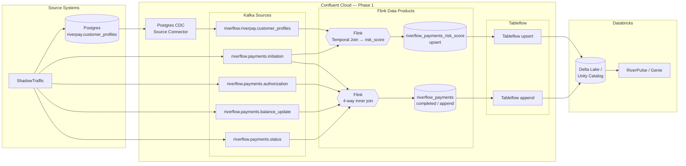

# Workshop: Real-Time Payments Ops with Confluent and Databricks

**Hands-on tour**: ~60-90 minutes
**Difficulty**: Intermediate
**Technical requirements**: Working knowledge of AWS, SQL, and basic command-line operations
**Workshop type**: **Demo mode** (single `terraform apply` provisions the full pipeline). **Self-service** and **instructor-led** modes are planned for a later release.

## Overview

This hands-on workshop demonstrates a **real-time instant-payments operations pipeline** for *RiverPay*, a fictitious mid-size payments processor that sits behind ~40 regional banks and credit unions.

You will ingest customer profiles via CDC, stream RiverFlow payment lifecycle events, enrich them with Flink to create two data products *completed-payments* and an *risk_score*, and then seamlessly sync those data products via Tableflow into Databricks to answer live ops questions in Genie (RiverPulse).

## Use case

RiverPay's partner banks need instant-payments parity, but ops tooling is still batch-based. End-of-day reports cannot answer: *which payment needs attention right now?* This workshop is an **operational-visibility story where `risk_score` means operational exception probability.

- **RiverFlow** is RiverPay's instant-payments rail (a four-stage lifecycle that maps to FedNow/RTP-style flows).
- **RiverPulse** is the real-time ops/analytics layer on top — Tableflow into Databricks Genie.

### Three business questions (RiverPulse)

1. Which payments are most likely to need manual intervention right now?
2. Which customers drive the highest operational exception exposure in the last 7 days?
3. What is the RiverFlow lifecycle completion rate from initiation to completed status? (Phase 1 proxy; stall drill-down is backlog)

### What you'll build

1. **Capture** customer profiles from PostgreSQL with CDC
2. **Stream** payment lifecycle events (initiation → authorization → balance update → status)
3. **Produce Flink data products** — completed payments (4-way inner join) + operational `risk_score` (temporal join)
4. **Serve** those products via Tableflow into Unity Catalog
5. **Analyze** the data with natural language using Databricks *Genie*

**Tableflow publishes only the two Flink data products** (`riverflow_payments` append, `riverflow_payments_risk_score` upsert). Raw lifecycle topics stay Kafka sources.

## Get Started (Cloud path)

1. Confirm accounts and build the Docker image — [LAB 0](labs/demo/LAB0_prerequisites/LAB0.md)
2. Configure credentials — [LAB 1](labs/demo/LAB1_account_setup/LAB1.md)
3. Deploy and observe — [LAB 2](labs/demo/LAB2_deploy_and_observe/LAB2.md)
4. Ask Genie the RiverPulse questions — [LAB 3](labs/demo/LAB3_riverpulse_analytics/LAB3.md)
5. Tear down — [LAB 4](labs/demo/LAB4_cleanup/LAB4.md)

> [!WARNING]
> **Prerequisites and cost**
>
> You need the following resources:
>
> - Confluent Cloud (admin API key)
> - **Unity Catalog–enabled** Databricks workspace
> - AWS (EC2/S3/VPC/IAM)
> - Git
> - Docker Desktop

## Datasets

| Dataset | Source | Topic / table | Tableflow |
|---------|--------|----------------|-----------|
| Customer profiles | Postgres → CDC | `riverflow.riverpay.customer_profiles` | No (Kafka source) |
| Payment initiation | ShadowTraffic → Kafka | `riverflow.payments.initiation` | No |
| Authorization | ShadowTraffic → Kafka | `riverflow.payments.authorization` | No |
| Balance update | ShadowTraffic → Kafka | `riverflow.payments.balance_update` | No |
| Status | ShadowTraffic → Kafka | `riverflow.payments.status` | No |
| Completed payments | Flink MT (inner join) | `riverflow_payments` | Yes (append) |
| Risk score | Flink MT (temporal join) | `riverflow_payments_risk_score` | Yes (upsert) |

## Architecture

Notes and legend: [`context/fsi_payments_workshop_architecture.md`](context/fsi_payments_workshop_architecture.md).

## Demo Paths

| Path | What you get | Start here |
|------|----------------|------------|
| **Confluent Cloud (Phase 1)** | CDC → RiverFlow topics → Flink data products → Tableflow → Databricks Genie | [labs/demo](labs/demo/README.md) |
| **Confluent Platform on ROSA (RiverPay-lite)** | ROSA HCP + CFK + Confluent Platform + RiverPay lifecycle topics in Control Center | [labs/cp-rosa](labs/cp-rosa/README.md) |

### Confluent Cloud Labs

| Lab | Title | Time |
|-----|-------|------|
| [LAB 0](labs/demo/LAB0_prerequisites/LAB0.md) | Prerequisites | ~10 min |
| [LAB 1](labs/demo/LAB1_account_setup/LAB1.md) | Account setup | ~15 min |
| [LAB 2](labs/demo/LAB2_deploy_and_observe/LAB2.md) | Deploy and observe | ~20–25 min (apply) + tour |
| [LAB 3](labs/demo/LAB3_riverpulse_analytics/LAB3.md) | RiverPulse analytics (Genie) | ~15 min |
| [LAB 4](labs/demo/LAB4_cleanup/LAB4.md) | Cleanup | ~10 min |

### Confluent Platform Labs

| Lab | Title | Time |
|-----|-------|------|
| [LAB 0](labs/cp-rosa/LAB0_prerequisites/LAB0.md) | Prerequisites | ~10 min |
| [LAB 1](labs/cp-rosa/LAB1_account_setup/LAB1.md) | Account setup | ~15 min |
| [LAB 2](labs/cp-rosa/LAB2_provision_rosa/LAB2.md) | Provision ROSA (Stage 1) | ~30–45+ min (apply) |
| [LAB 3](labs/cp-rosa/LAB3_deploy_and_observe/LAB3.md) | Deploy CFK + observe | ~15–25 min + tour |
| [LAB 4](labs/cp-rosa/LAB4_cleanup/LAB4.md) | Cleanup | ~20–40 min |

### Shared Content

- [Troubleshooting (Cloud)](labs/shared/troubleshooting.md)
- [Troubleshooting (cp-rosa)](labs/cp-rosa/troubleshooting.md)
- [Recap](labs/shared/recap.md)

## Tech stack (Cloud path)

- Confluent Cloud (Kafka, Schema Registry, Flink, Tableflow)
- PostgreSQL on AWS EC2 (CDC source)
- ShadowTraffic (synthetic profiles + payment lifecycle)
- AWS (VPC, S3, IAM)
- Databricks (Unity Catalog, Genie)

## License

See [LICENSE](LICENSE).
