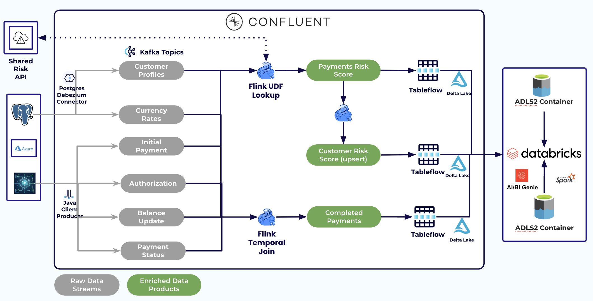

# Workshop: Real-Time Payments Ops with Confluent and Databricks

**Duration**: ~60–90 minutes

**Difficulty**: Intermediate

**Technical Requirements**: Working knowledge of cloud platforms (AWS or Azure), SQL, and basic command-line operations

**Workshop Type**: This workshop is currently designed to work in these three modes:

- *[self-service](#️-self-service)*
- *[instructor-led](#-instructor-led)*
- *[demo](#-demo)*

## 📖 Overview

This hands-on workshop demonstrates a **real-time instant-payments operations pipeline** for *RiverPay*, a fictitious mid-size payments processor that sits behind ~40 regional banks and credit unions.

You will ingest customer profiles and FX rates via CDC, stream RiverFlow payment lifecycle events (multi-currency), enrich them with Flink to create three data products — *completed payments* (with FX temporal join), an operational *risk_score* (profile temporal join + external risk UDF), and a trailing-24h *customer risk exposure* aggregate (genuine upsert) — then sync those products via Tableflow into Databricks Genie (*RiverPulse*).

## 🏦 Use Case

RiverPay's partner banks need instant-payments parity, but ops tooling is still batch-based. End-of-day reports cannot answer: *which payment needs attention right now?* This workshop is an **operational-visibility story** where `risk_score` means operational exception probability — not fraud.

- **RiverFlow** is RiverPay's instant-payments rail (a four-stage lifecycle that maps to FedNow/RTP-style flows).
- **RiverPulse** is the real-time ops/analytics layer on top — Tableflow into Databricks Genie.

### Three business questions (RiverPulse)

1. Which payments are most likely to need manual intervention right now?
2. Which customers drive the highest operational exception exposure in the last 24 hours?
3. What is the RiverFlow lifecycle completion rate from initiation to completed status? (Phase 1 proxy: completed = 4-way join + FX enrichment; stall drill-down is backlog)

Expand the accordion below for more background. Otherwise, continue to [Datasets](#-datasets) and [Workshop Labs](#-workshop-labs).

Use Case Details

### ⚠️ The Challenge

As instant-payments volume grows, RiverPay's ops team is flying blind between batch report runs. Partner banks expect FedNow/RTP-style parity; RiverPay needs real-time signal on payments that are stuck or likely to need a human — without building and maintaining custom lakehouse pipelines.

### 👥 Personas

- **Dana Ruiz, VP of Payment Operations** — owns “which payments need manual intervention right now?”
- **Marcus Chen, Head of Data Platform** — wants governed data in Databricks without custom pipeline toil (Tableflow)
- **Priya Anand, Compliance & Risk Lead** — audience for a light PII / CSFLE talking point (not a full security lab)

### 🛠️ What You'll Build

1. **Capture** customer profiles and FX rates from PostgreSQL with CDC
2. **Stream** payment lifecycle events (initiation → authorization → balance update → status)
3. **Produce Flink data products** — completed payments (4-way inner join + FX TTJ), operational `risk_score` (profile TTJ + external risk UDF), and trailing-24h customer risk exposure (`OVER` window + primary key = genuine upsert)
4. **Serve** those products via Tableflow into Unity Catalog (TTL / right-to-forget talking point)
5. **Analyze** the data with natural language using Databricks *Genie*

**Tableflow publishes only the three Flink data products** (`riverflow_payments` append, `riverflow_payments_risk_score` upsert, `riverflow_customer_risk_exposure_24h` upsert). Raw lifecycle topics stay Kafka sources.

### 🎓 Key Learning Outcomes

- **Infrastructure as Code** — Deploy Confluent Cloud + cloud + Databricks resources with Terraform
- **Change Data Capture** — Stream Postgres profiles and FX rates into Kafka
- **Stream Processing** — Flink SQL: multi-stream joins, temporal joins, external UDF
- **Data Lake Integration** — Tableflow to Delta Lake / Unity Catalog with data TTL
- **Ops Analytics** — Answer RiverPulse questions in Databricks Genie

### 🧩 Key Components

1. **Data Sources** — ShadowTraffic (profiles, FX, lifecycle) + PostgreSQL + shared Risk Scoring API
2. **Ingestion** — Postgres CDC connector + Kafka producers for lifecycle topics
3. **Processing** — Apache Flink SQL (completed-payments MT + risk-score MT + customer risk exposure MT)
4. **Integration** — Confluent Tableflow → Delta Lake (S3 or ADLS Gen2)
5. **Analytics** — Databricks Unity Catalog + Genie (RiverPulse)

Full narrative skin: [`USECASE.md`](USECASE.md). Architecture notes: [`context/fsi_payments_workshop_architecture.md`](context/fsi_payments_workshop_architecture.md).

## 🗄 Datasets

| Dataset | Source | Topic / table | Tableflow |
|---------|--------|----------------|-----------|
| Customer profiles | Postgres → CDC | `riverflow.riverpay.customer_profiles` | No (Kafka source) |
| FX rates | Postgres → CDC (upserts ~5s) | `riverflow.riverpay.fx_rates` | No |
| Payment initiation | ShadowTraffic → Kafka | `riverflow.payments.initiation` | No |
| Authorization | ShadowTraffic → Kafka | `riverflow.payments.authorization` | No |
| Balance update | ShadowTraffic → Kafka | `riverflow.payments.balance_update` | No |
| Status | ShadowTraffic → Kafka | `riverflow.payments.status` | No |
| Completed payments | Flink MT (inner join + FX TTJ) | `riverflow_payments` | Yes (append) |
| Risk score | Flink MT (profile TTJ + risk UDF) | `riverflow_payments_risk_score` | Yes (upsert) |
| Customer risk exposure | Flink MT (trailing-24h OVER aggregate) | `riverflow_customer_risk_exposure_24h` | Yes (upsert) |

## 🔬 Workshop Labs

This workshop supports multiple modes. Choose the path that matches your situation:

> [!WARNING]
> **Prerequisites and cost**
>
> Cloud paths typically need Confluent Cloud (admin API key), a **Unity Catalog–enabled** Databricks workspace, AWS and/or Azure, Git, and Docker Desktop. `terraform apply` creates billable resources — plan to run the cleanup lab when you finish.

### 🎓 Instructor-Led

> Hands-on with Confluent Cloud and Databricks products. Cloud accounts and infrastructure are **pre-provisioned**. You write Flink SQL, enable Tableflow, and answer RiverPulse questions in Genie.
>
> Use it only when instructed by your workshop instructor/leader.
>
> **Operators:** Shared Azure infra + per-attendee stacks — [`docs/operator-azure-elevate.md`](./docs/operator-azure-elevate.md) and [`wsa-spec-azure.yaml`](./wsa-spec-azure.yaml).

| Lab | Duration | Details |
|-----|----------|---------|
| [LAB 1: Claim Your Account](./labs/instructor-led/LAB1_claim_account/LAB1.md) | ~5 min | **Claim your workshop account**: complete the claim form, receive credentials, verify Confluent Cloud and Databricks. |
| [LAB 2: Explore Your Environment](./labs/instructor-led/LAB2_explore_environment/LAB2.md) | ~10 min | **Tour your environment**: CDC topics, lifecycle topics, Flink compute pool, risk CONNECTION/UDF. |
| [LAB 3: Stream Processing](./labs/instructor-led/LAB3_stream_processing/LAB3.md) | ~20 min | **Transform streams**: Flink MTs — completed payments (FX temporal join) + operational risk (profile TTJ + UDF). |
| [LAB 4: Tableflow](./labs/instructor-led/LAB4_tableflow/LAB4.md) | ~10 min | **Enable Tableflow**: publish the three Flink data products; TTL / right-to-forget talking point. |
| [LAB 5: RiverPulse Analytics](./labs/instructor-led/LAB5_riverpulse_analytics/LAB5.md) | ~15 min | **Ask Genie**: answer the three RiverPulse business questions. |
| [LAB 6: Wrap Up](./labs/instructor-led/LAB6_wrap_up/LAB6.md) | ~5 min | **Recap**: review accomplishments and next steps. |

### 🛠️ Self-Service

> Fully hands-on: you sign up for your own cloud accounts, deploy with Terraform, then build Flink MTs and enable Tableflow yourself.
>
> Use it to learn how you could run a similar pipeline in your own Confluent Cloud and Databricks environments.
>
> Terraform: [`terraform/aws`](./terraform/aws/) (recommended) or [`terraform/azure`](./terraform/azure/) with empty `shared_*`.

| Lab | Duration | Details |
|-----|----------|---------|
| [LAB 0: Prerequisites](./labs/self-service/LAB0_prerequisites/LAB0.md) | ~10 min | **Set up prerequisites**: cloud accounts, Git, Docker, clone the repo, build images. |
| [LAB 1: Account Setup](./labs/self-service/LAB1_account_setup/LAB1.md) | ~15 min | **Configure credentials**: Confluent Cloud API keys, Databricks service principal, AWS or Azure auth, `terraform.tfvars`. |
| [LAB 2: Deploy & Explore](./labs/self-service/LAB2_deploy_and_explore/LAB2.md) | ~20–45 min | **Deploy with Terraform**: provision infra, CDC, lifecycle traffic, Risk API/UDF plumbing; tour the environment. |
| [LAB 3: Stream Processing](./labs/self-service/LAB3_stream_processing/LAB3.md) | ~20 min | **Transform streams**: write Flink MTs for FX-aware completed payments and operational risk. |
| [LAB 4: Tableflow](./labs/self-service/LAB4_tableflow/LAB4.md) | ~10 min | **Enable Tableflow**: sync Flink data products to Unity Catalog; TTL talking point. |
| [LAB 5: RiverPulse Analytics](./labs/self-service/LAB5_riverpulse_analytics/LAB5.md) | ~15 min | **Ask Genie**: answer the three RiverPulse business questions. |
| [LAB 6: Wrap-up & Cleanup](./labs/self-service/LAB6_cleanup/LAB6.md) | ~10 min | **Tear down**: `terraform destroy` and recap. |

### 🚀 Demo

> Builds on self-service by automating almost all pipeline steps (Flink MTs + Tableflow included). Best for short-term, long-term, or always-on demos with minimal in-product setup.
>
> Use it to show immediate value after one `terraform apply`.
>
> Demo Terraform root: [`terraform/aws-demo`](./terraform/aws-demo/).

| Lab | Duration | Details |
|-----|----------|---------|
| [LAB 0: Prerequisites](./labs/demo/LAB0_prerequisites/LAB0.md) | ~10 min | **Set up prerequisites**: Confluent Cloud, Databricks (UC), AWS, Git, Docker image. |
| [LAB 1: Account Setup](./labs/demo/LAB1_account_setup/LAB1.md) | ~15 min | **Configure credentials**: API keys, Databricks SP, AWS, `terraform.tfvars`. |
| [LAB 2: Deploy and Observe](./labs/demo/LAB2_deploy_and_observe/LAB2.md) | ~20–25 min | **Deploy everything**: one apply provisions AWS, Confluent, Flink MTs, Tableflow, UC; guided pipeline tour. |
| [LAB 3: RiverPulse Analytics](./labs/demo/LAB3_riverpulse_analytics/LAB3.md) | ~15 min | **Ask Genie**: answer the three RiverPulse business questions. |
| [LAB 4: Cleanup](./labs/demo/LAB4_cleanup/LAB4.md) | ~10 min | **Tear down**: `terraform destroy` and leftover checks. |

### 🧩 Confluent Platform on ROSA

> Parallel **RiverPay-lite** path on Red Hat OpenShift Service on AWS (ROSA): Confluent for Kubernetes + Confluent Platform, lifecycle topics visible in Control Center. No Flink / Tableflow / Databricks on this path yet.
>
> Terraform: [`terraform/cp-rosa/`](./terraform/cp-rosa/) (Stage 1 then Stage 2). Labs: [`labs/cp-rosa/`](./labs/cp-rosa/).

| Lab | Duration | Details |
|-----|----------|---------|
| [LAB 0: Prerequisites](./labs/cp-rosa/LAB0_prerequisites/LAB0.md) | ~10 min | **Set up prerequisites**: accounts, tools, clone. |
| [LAB 1: Account Setup](./labs/cp-rosa/LAB1_account_setup/LAB1.md) | ~15 min | **Configure credentials** for the ROSA / CP path. |
| [LAB 2: Provision ROSA](./labs/cp-rosa/LAB2_provision_rosa/LAB2.md) | ~30–45+ min | **Stage 1 Terraform**: provision ROSA HCP. |
| [LAB 3: Deploy and Observe](./labs/cp-rosa/LAB3_deploy_and_observe/LAB3.md) | ~15–25 min | **Stage 2**: CFK + CP + RiverPay-lite; observe in Control Center. |
| [LAB 4: Cleanup](./labs/cp-rosa/LAB4_cleanup/LAB4.md) | ~20–40 min | **Tear down** ROSA / CP resources. |

### Additional Resources

- **[Recap](./labs/shared/recap.md)**: Summary of accomplishments and talking points
- **[Troubleshooting (Cloud)](./labs/shared/troubleshooting.md)**: Common issues for demo, self-service, and instructor-led
- **[Troubleshooting (cp-rosa)](./labs/cp-rosa/troubleshooting.md)**: ROSA / CP path issues
- **[Genie prompts](./sql/genie_prompts.md)**: Suggested RiverPulse prompts and expected answer shape

## 🏁 Conclusion

Congratulations — you've completed the RiverPay hands-on workshop on real-time payments ops with Confluent and Databricks (or the parallel Confluent Platform on ROSA path).

## License

See [LICENSE](LICENSE).
