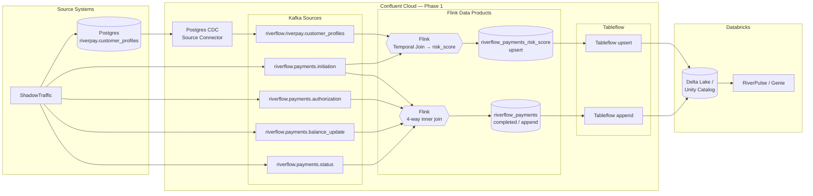

# FSI Real-Time Payments Workshop — Phase 1 Architecture

Matches the Phase 1 runbook, formalized topic names in `AGENTS.md`, and the
demo Terraform product under `terraform/aws-demo/`.

**Flink data products (Tableflow sinks):**
- `riverflow_payments` — 4-way inner join of lifecycle stages (completed only, append)
- `riverflow_payments_risk_score` — initiation × profile temporal join (upsert)

Raw lifecycle topics remain Kafka sources only (not Tableflow-enabled in Phase 1).
Progressive / stall-aware payment state is Phase 2 backlog.

## Notes

- Happy path only; single currency (USD); flattened Avro payloads (+ Schema Registry).
- `riverflow_payments` emits only when all four lifecycle stages match (`payment_id`).
- Risk hero joins **initiation × customer profile** (temporal) for operational `risk_score` / `risk_reason`.
- Genie completion rate Phase 1 proxy: `completed` (`riverflow_payments`) / `initiated_enriched` (`riverflow_payments_risk_score`).
- Downstream views: `riverpulse_high_risk_payments`, `riverpulse_customer_risk_7d`, `riverpulse_lifecycle_completion`.
- **Phase 2 backlog:** progressive or stall-aware payment state (in-flight stage drill-down). Progressive upsert deferred.
