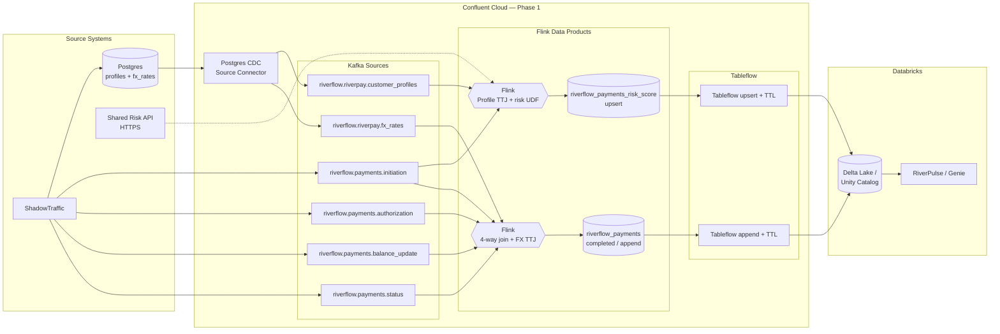

# FSI Real-Time Payments Workshop — Phase 1 Architecture

Matches the Phase 1 runbook, formalized topic names in `AGENTS.md`, and the
Cloud Terraform products (`terraform/aws-demo/`; Elevate:
`terraform/azure-shared/` + `terraform/azure/`).

**Flink data products (Tableflow sinks):**
- `riverflow_payments` — 4-way inner join of lifecycle stages + FX temporal join (completed only, append)
- `riverflow_payments_risk_score` — profile temporal join + external risk UDF (one row per payment)
- `riverflow_customer_risk_exposure_24h` — trailing-24h `OVER` aggregate per customer, `PRIMARY KEY (customer_id)` (genuine upsert)

Raw lifecycle topics remain Kafka sources only (not Tableflow-enabled in Phase 1).
Tableflow data TTL supports a right-to-forget talking point. Progressive /
stall-aware payment state and failed-payment/DLQ paths are Phase 2 backlog.

```mermaid
flowchart LR
    ST["ShadowTraffic"]
    PG[("Postgres<br/>profiles + fx_rates")]
    RISK_API["Shared Risk API<br/>HTTPS"]

    subgraph SRC["Source Systems"]
        ST
        PG
        RISK_API
    end

    CDC["Postgres CDC<br/>Source Connector"]
    T_CDC["riverflow.riverpay.customer_profiles"]
    T_FX["riverflow.riverpay.fx_rates"]
    T_INIT["riverflow.payments.initiation"]
    T_AUTH["riverflow.payments.authorization"]
    T_BAL["riverflow.payments.balance_update"]
    T_STAT["riverflow.payments.status"]
    T_PAY[("riverflow_payments<br/>completed / append")]
    T_RISK[("riverflow_payments_risk_score<br/>upsert")]
    FLINK_PAY{{"Flink<br/>4-way join + FX TTJ"}}
    FLINK_RISK{{"Flink<br/>Profile TTJ + risk UDF"}}
    TF_PAY["Tableflow append + TTL"]
    TF_RISK["Tableflow upsert + TTL"]

    subgraph CC["Confluent Cloud — Phase 1"]
        CDC
        subgraph TOPICS["Kafka Sources"]
            T_CDC
            T_FX
            T_INIT
            T_AUTH
            T_BAL
            T_STAT
        end
        subgraph PRODUCTS["Flink Data Products"]
            FLINK_PAY
            FLINK_RISK
            T_PAY
            T_RISK
        end
        subgraph TF["Tableflow"]
            TF_PAY
            TF_RISK
        end
    end

    DL[("Delta Lake /<br/>Unity Catalog")]
    GENIE["RiverPulse / Genie"]

    subgraph DBX["Databricks"]
        DL
        GENIE
    end

    ST --> PG
    ST --> T_INIT
    ST --> T_AUTH
    ST --> T_BAL
    ST --> T_STAT

    PG --> CDC
    CDC --> T_CDC
    CDC --> T_FX

    T_CDC --> FLINK_RISK
    T_INIT --> FLINK_RISK
    RISK_API -.-> FLINK_RISK
    FLINK_RISK --> T_RISK

    T_INIT --> FLINK_PAY
    T_AUTH --> FLINK_PAY
    T_BAL --> FLINK_PAY
    T_STAT --> FLINK_PAY
    T_FX --> FLINK_PAY
    FLINK_PAY --> T_PAY

    T_PAY --> TF_PAY
    T_RISK --> TF_RISK

    TF_PAY --> DL
    TF_RISK --> DL
    DL --> GENIE
```

## Notes

- Happy path only; multi-currency (USD + GBP, AUD, CAD, JPY, EUR); flattened Avro payloads (+ Schema Registry).
- `riverflow_payments` emits only when all four lifecycle stages match (`payment_id`), enriched with FX `FOR SYSTEM_TIME AS OF` join.
- Risk hero: **initiation × customer profile** (temporal) then **external risk UDF** (shared workshop URL) for operational `risk_score` / `risk_reason`.
- Genie completion rate Phase 1 proxy: `completed` (`riverflow_payments` — 4-way join + FX) / `initiated_enriched` (`riverflow_payments_risk_score`).
- Downstream views: `riverpulse_high_risk_payments`, `riverpulse_customer_risk_24h`, `riverpulse_lifecycle_completion`.
- **Delivery:** demo automates Flink + Tableflow; instructor-led Azure leaves those as attendee work.
- **Phase 2 backlog:** progressive/stall-aware state; failed-payment/DLQ; NSF/fraud; `MATCH_RECOGNIZE`; ISO nesting.
