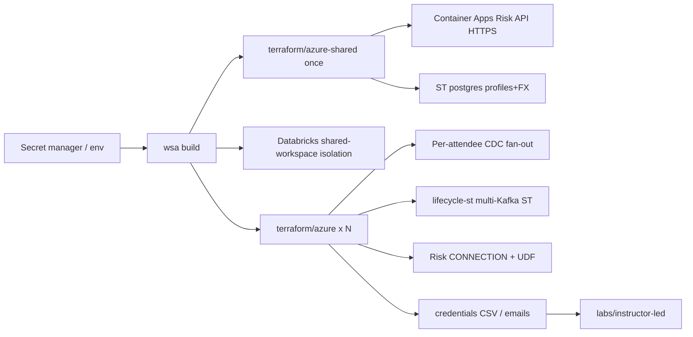

# Operator guide: Azure Elevate instructor-led (WSA)

For operators who provision **attendee environments** on Azure using the Workshop
Setup Accelerator (`wsa`) and [`labs/instructor-led/`](../labs/instructor-led/).

| Piece | Location |
|-------|----------|
| Spec | [`wsa-spec-azure.yaml`](../wsa-spec-azure.yaml) |
| Shared infra (once) | [`terraform/azure-shared/`](../terraform/azure-shared/) |
| Per-attendee Terraform | [`terraform/azure/`](../terraform/azure/) |
| Author notes | [`context/elevate_2026_internal_changelog.md`](../context/elevate_2026_internal_changelog.md) |

Demo mode (full pipeline automated on AWS) stays on [`terraform/aws-demo/`](../terraform/aws-demo/) + [`labs/demo/`](../labs/demo/) — not this guide.



> Prefer [`docs/operator-instructor-led.md`](operator-instructor-led.md) for the shared Azure+AWS flow (including `scripts/wsa-deploy-lifecycle-st.sh`). This page keeps Azure-specific ACR / Container Apps detail.

## What shared vs per-attendee owns

| Layer | Shared (`azure-shared`) | Per attendee (`azure`) | Lifecycle aggregator |
|-------|-------------------------|-------------------------|----------------------|
| Azure RG / VNet / ADLS | Yes | Uses shared_* | — |
| Postgres VM | Yes | CDC into this host | — |
| ShadowTraffic profiles + FX | Yes (`shadowtraffic-riverpay`) | — | — |
| Risk Scoring API | Yes (Container Apps HTTPS) | Flink CONNECTION uses URL | — |
| Confluent env / Kafka / Flink pool | — | Yes | — |
| Lifecycle ShadowTraffic | — | Off (`enable_lifecycle_shadowtraffic: false`) | Yes (`shadowtraffic-lifecycle`) |
| Flink MTs / Tableflow topics | — | **Attendee labs** (not Terraform) | — |
| Databricks catalog/grants | Shared connector; per-user schema | Yes | — |

## Prerequisites

1. **`wsa` binary** and a secret manager / env file for `env_vars` in the spec (e.g. `op run --env-file=.env.tpl`)
2. **Terraform** `>= 1.7`, **Git**, **Azure CLI** (`az`) — required for `az acr build` during shared Risk API deploy
3. **Confluent Cloud** cloud-resource-management API key/secret
4. **Azure** service principal (`ARM_*`) with rights to create RG, VM, ACR, Container Apps, storage, monitoring
5. **Databricks** shared workspace (Premium / PAYG) + OAuth service principal; External data access enabled on the metastore
6. Built UDF JAR at `udf/riverpay-risk/dist/riverpay-risk-udf-1.0.0.jar` (see `udf/riverpay-risk/README.md`)
7. Spec `stage_paths` must include `services/risk-api/`, `shadowtraffic/`, and `udf/riverpay-risk/dist/` (already in `wsa-spec-azure.yaml`) so local-copy builds can resolve those paths outside `terraform/`

### Databricks workspace checklist

1. Shared workspace name matches the spec (`workshop-riverpay` by default) or change `isolation.databricks.workspace_name`.
2. Map host + SP into env (`TF_VAR_databricks_azure_host`, client id/secret).
3. Enable **External data access**; ensure a SQL warehouse exists (default name `Serverless Starter Warehouse`).
4. Confirm SSO / UPN pattern for `databricks_sso_email` in the spec.

## Environment variables

| Variable | Purpose |
|----------|---------|
| `TF_VAR_confluent_cloud_api_key` / `_secret` | Confluent Cloud |
| `TF_VAR_databricks_azure_host` | Shared workspace URL |
| `TF_VAR_databricks_azure_service_principal_client_id` / `_secret` | Workshop SP |
| `TF_VAR_owner_email` | Tagging / monitoring alerts |
| `ARM_TENANT_ID` / `ARM_CLIENT_ID` / `ARM_CLIENT_SECRET` / `ARM_SUBSCRIPTION_ID` | Azure |

WSA also injects cloud region (for example from `TF_VAR_azure_cloud_region`). See your WSA / accelerator docs.

### Shared-output → per-attendee injection

After shared apply, WSA prefixes shared Terraform outputs with `shared_` and passes them as `TF_VAR_shared_*`. Important RiverPay mappings:

| azure-shared output | Becomes | azure variable |
|---------------------|---------|----------------|
| `resource_group_name` | `TF_VAR_shared_resource_group_name` | `shared_resource_group_name` |
| `postgres_public_ip` | `TF_VAR_shared_postgres_public_ip` | `shared_postgres_public_ip` |
| `postgres_db_password` | `TF_VAR_shared_postgres_db_password` | `shared_postgres_db_password` |
| `postgres_debezium_password` | `TF_VAR_shared_postgres_debezium_password` | `shared_postgres_debezium_password` |
| `postgres_ssh_private_key_path` | `TF_VAR_shared_postgres_ssh_private_key_path` | `shared_postgres_ssh_private_key_path` |
| `postgres_ssh_username` | `TF_VAR_shared_postgres_ssh_username` | `shared_postgres_ssh_username` |
| `risk_api_endpoint` | `TF_VAR_shared_risk_api_endpoint` | `shared_risk_api_endpoint` |
| `risk_api_key` | `TF_VAR_shared_risk_api_key` | `shared_risk_api_key` |
| storage / dbx connector outputs | `TF_VAR_shared_*` | matching `shared_*` vars |

## Build and clean

```bash
# Dry-run size is account_count: 2 in the spec — raise for the event
op run --env-file=.env.tpl -- wsa build -w /path/to/workshop-fsi-payments/wsa-spec-azure.yaml

# Multi-cluster lifecycle ST (required when enable_lifecycle_shadowtraffic: false)
./scripts/wsa-deploy-lifecycle-st.sh apply --run-id "$WSA_RUN_ID" --cloud azure --auto-approve

op run --env-file=.env.tpl -- wsa clean -w /path/to/workshop-fsi-payments/wsa-spec-azure.yaml
# Before clean: destroy lifecycle ST first (see Teardown order)
```

Ensure the operator host can run **`az acr build`** (Azure CLI logged in as the same SP/subscription) before shared apply.

## Manual apply order (without WSA)

Useful for a single-stack smoke:

```bash
# 1) Shared
cd terraform/azure-shared
cp sample-tfvars terraform.tfvars   # fill owner_email, Databricks, etc.
az login
terraform init && terraform apply
../../services/risk-api/smoke.sh \
  "$(terraform output -raw risk_api_endpoint)" \
  "$(terraform output -raw risk_api_key)"

# 2) One attendee
cd ../azure
# set shared_* from azure-shared outputs + Confluent/Databricks creds (see sample-tfvars)
terraform init && terraform apply
```

## Smoke validation checklist (2 accounts)

Before a large event:

### Shared

- [ ] `azure-shared` apply succeeds (`az acr build` OK)
- [ ] Risk API: `services/risk-api/smoke.sh` against `risk_api_endpoint` returns health + score JSON
- [ ] `shadowtraffic-riverpay` container running on Postgres VM
- [ ] Postgres has `riverpay.customer_profiles` rows and `riverpay.fx_rates` (USD + 5 FX)

### Per attendee (×2)

- [ ] CDC topics `riverflow.riverpay.customer_profiles` and `riverflow.riverpay.fx_rates` have data
- [ ] Lifecycle topics receive initiation → status traffic
- [ ] One multi-cluster ST container: `shadowtraffic-lifecycle` (after `wsa-deploy-lifecycle-st.sh`)
- [ ] Flink: `SHOW CONNECTIONS` includes `riverpay_risk_api`; `lookup_operational_risk` exists
- [ ] Credentials CSV includes every field in the spec `credentials` block

### Attendee path

- [ ] LAB1 login (Confluent + Databricks SSO)
- [ ] LAB2 explores CDC + lifecycle + UDF
- [ ] LAB3 creates both MTs; rows appear (judge Genie by *shape*)
- [ ] LAB4 enables Tableflow + notes TTL
- [ ] `wsa clean` / destroy without provider-integration 409s

## Teardown order

1. Disable Tableflow topics in each attendee env (WSA `cleanup.disable_tableflow` or UI).
2. Destroy lifecycle ST: `./scripts/wsa-deploy-lifecycle-st.sh destroy --run-id "$WSA_RUN_ID" --cloud azure --auto-approve`
3. Destroy per-attendee stacks (`wsa clean` or `terraform destroy` in `azure/`).
4. Destroy `azure-shared` last (Risk API, shared ST, Postgres, ACR).

## Sizing and cost

1. Raise `account_count` in the spec for the real event.
2. Shared: one Postgres VM (size scales with `account_count` in azure-shared), Container Apps Risk API, ACR, ADLS.
3. Per attendee: Confluent Standard cluster + Flink pool (primary Confluent cost); one shared multi-Kafka lifecycle ST container.
4. Destroy promptly after the event.

## Attendee handoff

1. Use WSA credentials CSV / email dispenser.
2. Point attendees at [`labs/instructor-led/LAB1_claim_account/LAB1.md`](../labs/instructor-led/LAB1_claim_account/LAB1.md).
3. Facilitator notes: [`context/fsi_payments_workshop_facilitator_script.md`](../context/fsi_payments_workshop_facilitator_script.md).

## Troubleshooting

See [`labs/shared/troubleshooting.md`](../labs/shared/troubleshooting.md) (Elevate sections for Risk API, FX, lifecycle ST).
