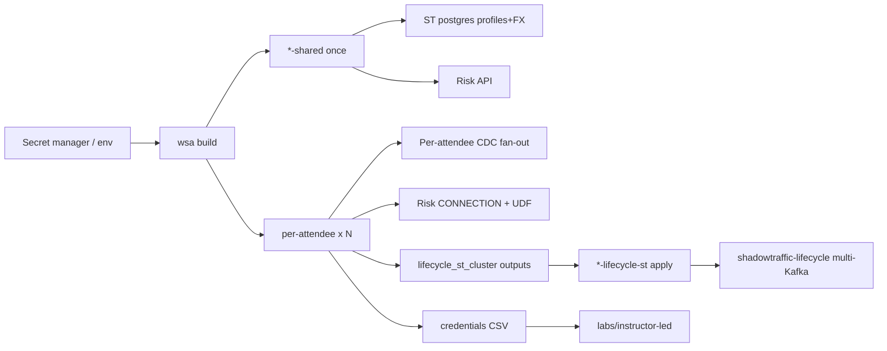

# Operator guide: instructor-led (WSA) — Azure + AWS

For operators who provision **attendee environments** using the Workshop Setup
Accelerator (`wsa`) and [`labs/instructor-led/`](../labs/instructor-led/).

| Piece | Azure | AWS |
|-------|-------|-----|
| Spec | [`wsa-spec-azure.yaml`](../wsa-spec-azure.yaml) | [`wsa-spec-aws.yaml`](../wsa-spec-aws.yaml) |
| Shared infra (once) | [`terraform/azure-shared/`](../terraform/azure-shared/) | [`terraform/aws-shared/`](../terraform/aws-shared/) |
| Per-attendee Terraform | [`terraform/azure/`](../terraform/azure/) | [`terraform/aws/`](../terraform/aws/) |
| Lifecycle ShadowTraffic | [`terraform/azure-lifecycle-st/`](../terraform/azure-lifecycle-st/) | [`terraform/aws-lifecycle-st/`](../terraform/aws-lifecycle-st/) |
| Post-account glue | [`scripts/wsa-deploy-lifecycle-st.sh`](../scripts/wsa-deploy-lifecycle-st.sh) | same (`--cloud aws`) |

Demo mode (full pipeline automated on AWS) stays on [`terraform/aws-demo/`](../terraform/aws-demo/) + [`labs/demo/`](../labs/demo/) — not this guide.

Azure-only notes (ACR / Container Apps Risk API): also see [`docs/operator-azure-elevate.md`](operator-azure-elevate.md).



## What shared vs per-attendee owns

| Layer | Shared (`*-shared`) | Per attendee | Lifecycle aggregator |
|-------|---------------------|--------------|----------------------|
| Network / storage | Yes | Uses `shared_*` | — |
| Postgres | Yes | CDC into this host | — |
| ShadowTraffic profiles + FX | Yes (`shadowtraffic-riverpay`) | — | — |
| Risk Scoring API | Yes (Azure: ACA HTTPS; AWS: EC2 HTTP `:8089`) | Flink CONNECTION uses URL | — |
| Confluent env / Kafka / Flink | — | Yes | — |
| Lifecycle ShadowTraffic | — | Off by default (`enable_lifecycle_shadowtraffic: false`) | Yes — one container, N Kafka connections |
| Flink MTs / Tableflow topics | — | **Attendee labs** | — |

Profiles/FX use **CDC fan-out** (one Postgres writer → N connectors). Lifecycle events use **one multi-connection ShadowTraffic** (N Kafka connections × 4 generators) — not N `st-life-*` containers.

## Prerequisites

1. **`wsa` binary** and a secret manager / env file for `env_vars` in the spec
2. **Terraform** `>= 1.7`, **Git**, cloud CLI (`az` or `aws`)
3. **Confluent Cloud** cloud-resource-management API key/secret
4. Cloud credentials (`ARM_*` or AWS keys) with rights for shared + per-account resources
5. **Databricks** shared workspace + OAuth service principal; External data access enabled
6. Built UDF JAR at `udf/riverpay-risk/dist/riverpay-risk-udf-1.0.0.jar`
7. Spec `stage_paths` include `services/risk-api/`, `shadowtraffic/`, `udf/riverpay-risk/dist/`

## Build order

```bash
# 1) Shared + N accounts
op run --env-file=.env.tpl -- wsa build -w /path/to/workshop-fsi-payments/wsa-spec-azure.yaml
# or: wsa-spec-aws.yaml

# 2) Multi-cluster lifecycle ShadowTraffic (required for lifecycle topics)
export WSA_RUN_ID=<run-id from build>
./scripts/wsa-deploy-lifecycle-st.sh apply --run-id "$WSA_RUN_ID" --cloud azure --auto-approve
# or: --cloud aws

# 3) Dispenser CSV → Google Sheet (after passwords exist in 1Password)
./bin/wsa dispenser-upload --sheets-credentials gmail-credentials.json \
  -w /path/to/workshop-fsi-payments/wsa-spec-azure.yaml
```

`wsa build` alone does **not** start lifecycle traffic when `enable_lifecycle_shadowtraffic: false`. Always run the aggregator script after a successful account phase.

After dry-runs or rebuilds, use `dispenser-upload` **Overwrite** (or `--yes`) so reviewers are not handed claimed / previously used rows. Prefer a fresh claim for each dry-run reviewer.
### Shared-output → per-attendee injection

WSA prefixes shared Terraform outputs with `shared_` → `TF_VAR_shared_*`.

| Shared output (examples) | Becomes |
|--------------------------|---------|
| `postgres_public_ip` / `postgres_hostname` | `TF_VAR_shared_postgres_*` |
| `postgres_db_password` / `postgres_debezium_password` | `TF_VAR_shared_postgres_*_password` |
| `postgres_ssh_private_key_path` / `postgres_ssh_username` | SSH for emergency per-account ST / ops |
| `risk_api_endpoint` / `risk_api_key` | Flink CONNECTION |
| `vpc_id` / `s3_bucket_*` (AWS) | `TF_VAR_shared_vpc_id` / `TF_VAR_shared_s3_*` |
| storage / dbx connector outputs | matching `shared_*` |

## Teardown order

1. Disable Tableflow topics in each attendee env (WSA `cleanup.disable_tableflow` or UI).
2. **Destroy lifecycle ST first** (while shared VM SSH still works):

   ```bash
   ./scripts/wsa-deploy-lifecycle-st.sh destroy --run-id "$WSA_RUN_ID" --cloud azure --auto-approve
   ```

3. `wsa clean` (accounts, then shared).

Do **not** destroy shared before the lifecycle aggregator — the destroy provisioner needs SSH to remove `shadowtraffic-lifecycle`.

## Smoke validation checklist (2 accounts)

### Shared

- [ ] `*-shared` apply succeeds
- [ ] Risk API health + score JSON
- [ ] `shadowtraffic-riverpay` running (profiles + FX)
- [ ] Postgres has `riverpay.customer_profiles` and `riverpay.fx_rates`

### After lifecycle-st apply

- [ ] One container: `sudo docker ps --filter name=shadowtraffic-lifecycle`
- [ ] Both attendee clusters receive initiation → status
- [ ] CDC topics still populated via fan-out
- [ ] Flink: `SHOW CONNECTIONS` includes `riverpay_risk_api`; UDF present
- [ ] Flink: `SHOW CREATE TABLE` on profiles + initiation shows changelog.mode + watermarks (Terraform ALTERs)
### Attendee path

- [ ] LAB1–LAB5 as in [`labs/instructor-led/`](../labs/instructor-led/)

## Sizing

- Shared host: MD guidance ~1–2 GB RAM / 2–4 vCPU headroom for ~95 Kafka connections (re-validate on ShadowTraffic **2.0.3**).
- Pin image `shadowtraffic/shadowtraffic:2.0.3` (do not use `:latest` mid-event).
- `initiation_throttle_ms` default **2500** keeps demo pace under ST 2.0 speedups.

## Troubleshooting

See [`labs/shared/troubleshooting.md`](../labs/shared/troubleshooting.md).
