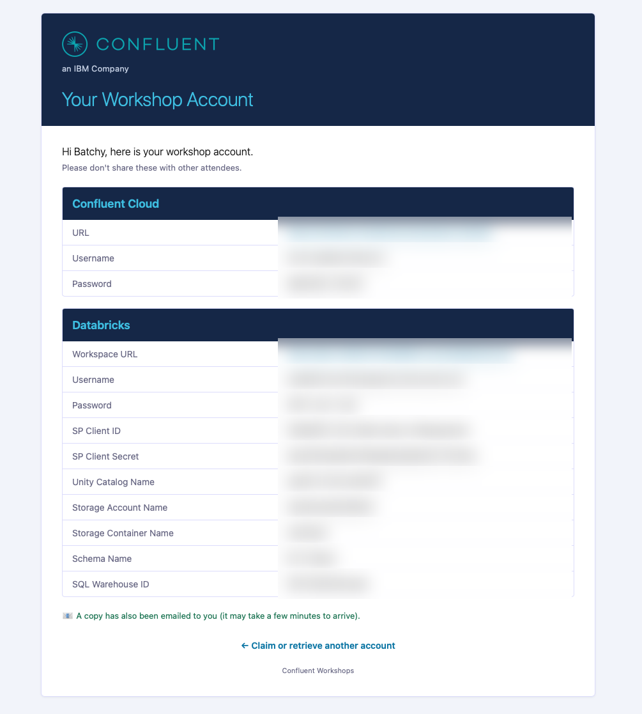

# LAB 1: Claim Your Account

## Overview

Welcome to the RiverPay workshop. Your instructor has pre-provisioned Confluent Cloud and Databricks for you. In this lab you claim your account and verify access.

### What you'll accomplish

1. Claim a workshop account
2. Receive credentials by email
3. Verify Confluent Cloud and Databricks access

### Prerequisites

- Web browser
- Email address

## Steps

### Step 1: Claim your account

1. Open the **Workshop Account** link from your instructor
2. Enter your **name** and **email**
3. Submit

You should see a screen that contains all of the inputs that you will need to progress through and complete this workshop.

> [!NOTE]
> **Account Claiming**
>
> If the form is closed, all accounts are claimed — follow as a spectator or ask the instructor about the next session.
>
>You should also receive the exact same information in an email within a few minutes.

### Step 2: Review credentials

| Field | Use |
|-------|-----|
| Confluent Cloud URL / email / password | Login to your environment |
| Databricks host / email / password | Login to the shared workspace |
| Unity Catalog name | Genie / SQL later |
| Schema name | Usually your Kafka cluster ID |
| SQL Warehouse ID | Genie / SQL |
| Databricks service principal client ID / secret | Tableflow catalog integration in LAB 4 |
| Risk API note (if provided) | Shared URL is already bound in Flink as `riverpay_risk_api` |

### Step 3: Verify Confluent Cloud

1. Open the Confluent Cloud URL and log in
2. Confirm you see your **environment** and **Kafka cluster**
3. Spot-check that topics exist (you will explore them in LAB 2)

### Step 4: Verify Databricks

1. Open the Databricks host and log in
2. If you see a transient **403**, refresh the page
3. Confirm you land on the workspace home

## Conclusion

Your environment is ready. Data generation and CDC are already running on shared infrastructure.

## What's next

**[LAB 2: Explore Your Environment](../LAB2_explore_environment/LAB2.md)**

## Troubleshooting

See [`labs/shared/troubleshooting.md`](../../shared/troubleshooting.md).
