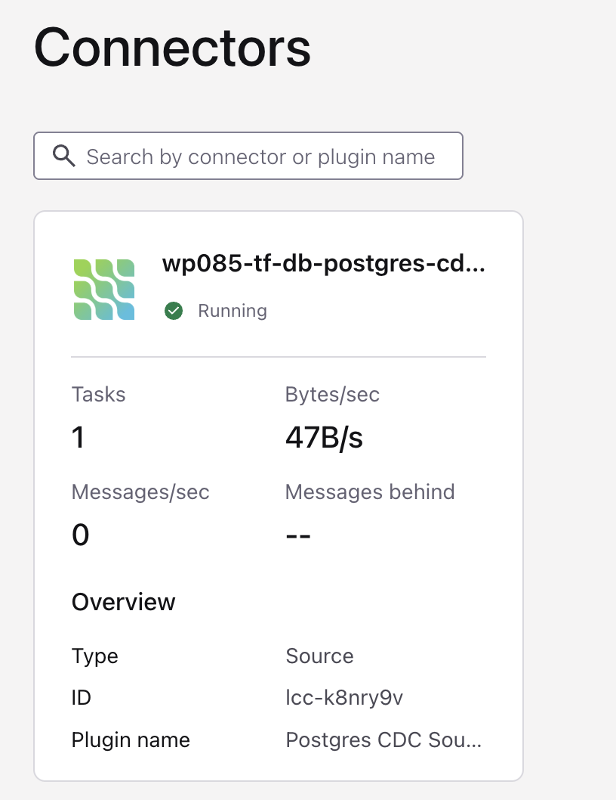
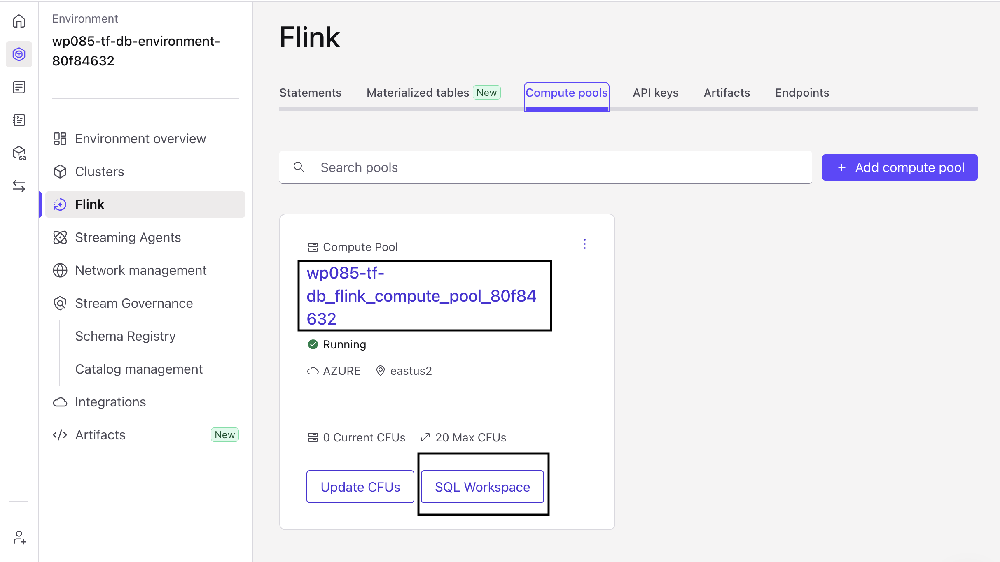
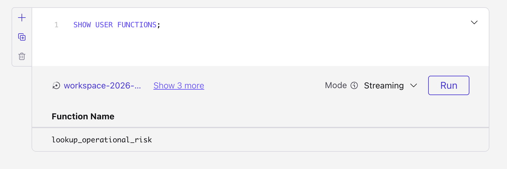
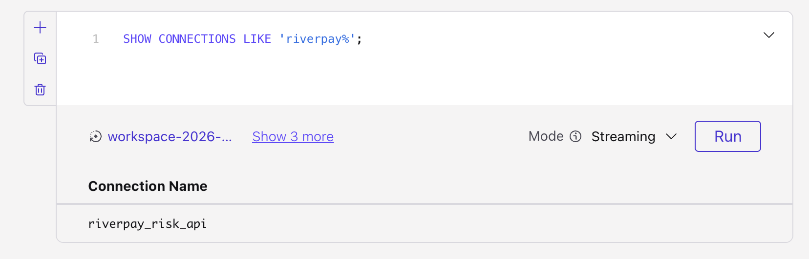
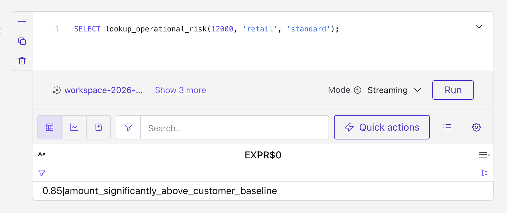

# LAB 2: Explore Your Environment

## Overview

Tour the RiverPay pipeline that is already ingesting data: Postgres CDC (profiles + FX rates), RiverFlow lifecycle topics, Flink compute pool, and the pre-registered risk UDF connection.

### What you'll accomplish

1. Inspect CDC topics for customer profiles and FX rates
2. Inspect RiverFlow payment lifecycle topics
3. Confirm Flink compute pool and `lookup_operational_risk` availability

### Prerequisites

Completed **[LAB 1](../LAB1_claim_account/LAB1.md)**.

## Steps

### Step 1: Kafka topics (Confluent Cloud)

In [Confluent Cloud](https://confluent.cloud/environments): your environment → cluster → **Topics**, confirm messages on:

| Topic | Role |
|-------|------|
| `riverflow.riverpay.customer_profiles` | CDC profiles (upsert) |
| `riverflow.riverpay.fx_rates` | CDC FX rates (upsert ~5s) |
| `riverflow.payments.initiation` | Lifecycle stage 1 |
| `riverflow.payments.authorization` | Stage 2 |
| `riverflow.payments.balance_update` | Stage 3 |
| `riverflow.payments.status` | Stage 4 |

**Expected result:** Profiles seeded (~100), FX rows for USD/GBP/AUD/CAD/JPY/EUR, and ongoing payment events. Currencies include USD plus foreign currencies.

### Step 2: Connectors

The Postgres CDC source is **pre-provisioned** for instructor-led (you do not create it in this lab). Open **Connectors** and confirm it is **Running** with table include list covering `riverpay.customer_profiles` and `riverpay.fx_rates`.




> [!NOTE]
> Building the CDC connector from scratch is out of scope for this path.
### Step 3: Flink compute pool

1. Open **Flink** → **Compute pools**. Pick the workshop pool, **not** the default one. It is named `<team>_flink_compute_pool_<id>` — for example `wp001-tf-db_flink_compute_pool_16255802`, where `wp001` is your team prefix.
2. Open its **SQL workspace**

   

3. Set catalog = your environment, database = your Kafka cluster
4. Run:

    ```sql
    SHOW USER FUNCTIONS;
    -- Expect lookup_operational_risk when operators pre-registered the UDF
    ```

    

    ```sql
    SHOW CONNECTIONS LIKE 'riverpay%';
    -- Expect riverpay_risk_api (HTTPS shared Risk Scoring API)
    ```

    

> [!TIP]
> Plain `SHOW FUNCTIONS;` lists every built-in function too (hundreds of rows, including operators like `%` and `<=`). `SHOW USER FUNCTIONS;` restricts the output to user-defined functions in the current catalog and database, so the workshop UDF is the only thing you see. For details on one function:
>
> ```sql
> DESCRIBE FUNCTION EXTENDED lookup_operational_risk;
> -- Shows kind, argument types, return type, and signature
> ```

    ```sql
    SELECT lookup_operational_risk(12000, 'retail', 'standard');
    -- Expect a string like: 0.42|High amount for retail standard tier
    ```



> [!NOTE]
> `lookup_operational_risk` calls the shared Risk Scoring API and returns a `score|reason` string given an amount, customer segment, and tier. The score (e.g. `0.42`) is an **operational exception probability** from 0.0 (routine) to 1.0 (near-certain exception) — how likely the payment is to need manual review, not a fraud score. `>= 0.5` is treated as "high risk" downstream. In **LAB 3**, you'll call this UDF from Flink SQL to build the `riverflow_payments_risk_score` data product.

> [!NOTE]
> You do **not** create infrastructure here. LAB 3 is where you write Flink SQL for the data products.

#### Checkpoint

- [ ] CDC + lifecycle topics have data
- [ ] CDC connector healthy
- [ ] Flink pool opens; risk connection/UDF visible (or instructor confirms pre-reg status)

## Conclusion

Sources are live. Next you build the Flink data products yourself.

## What's next

**[LAB 3: Stream Processing](../LAB3_stream_processing/LAB3.md)**
