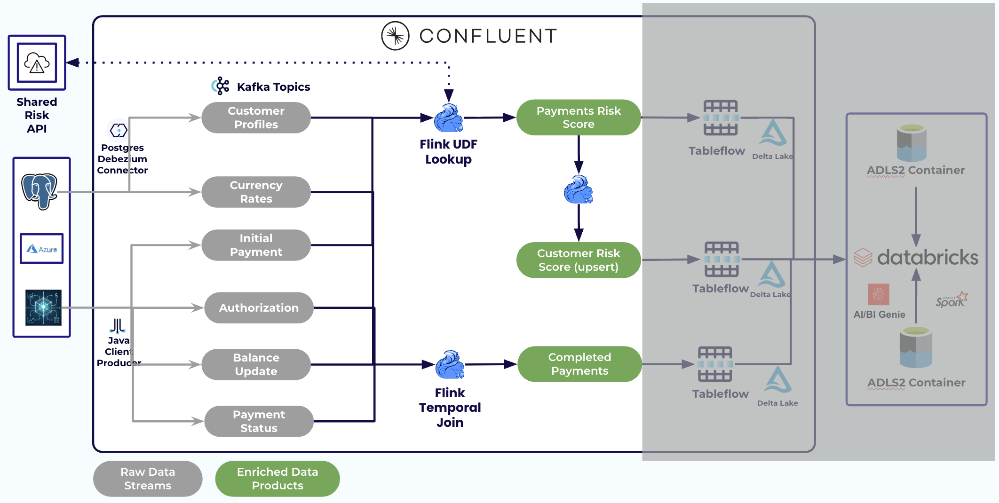
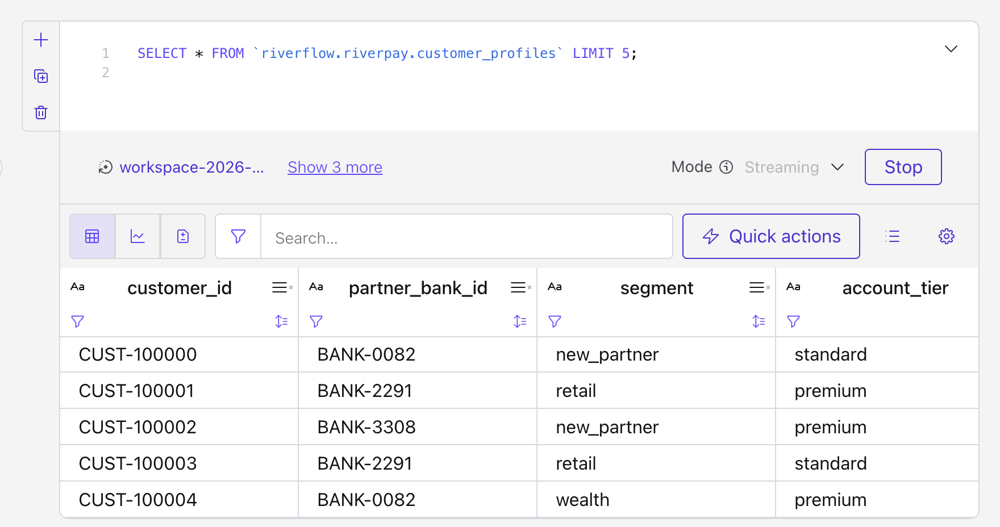
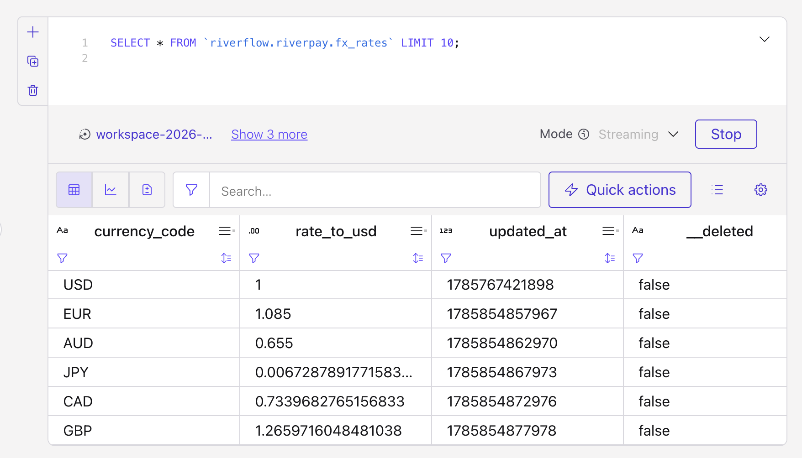
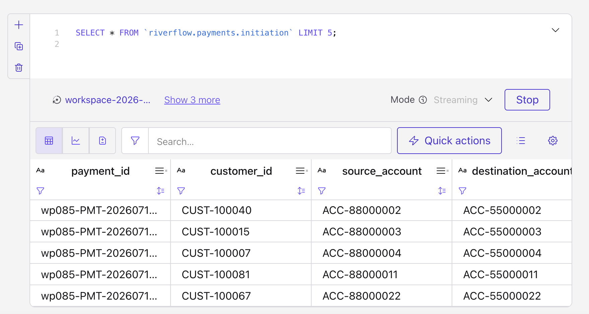
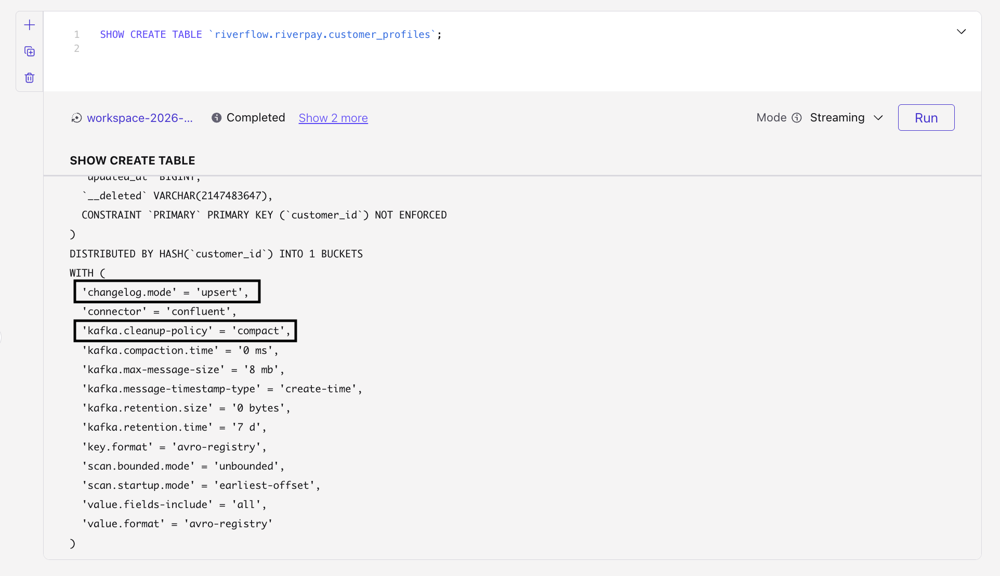
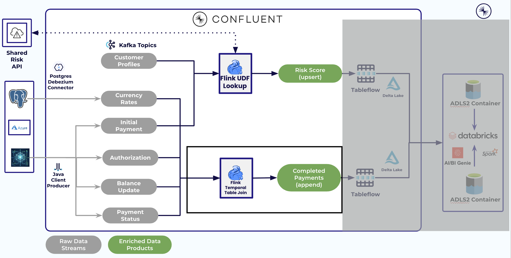
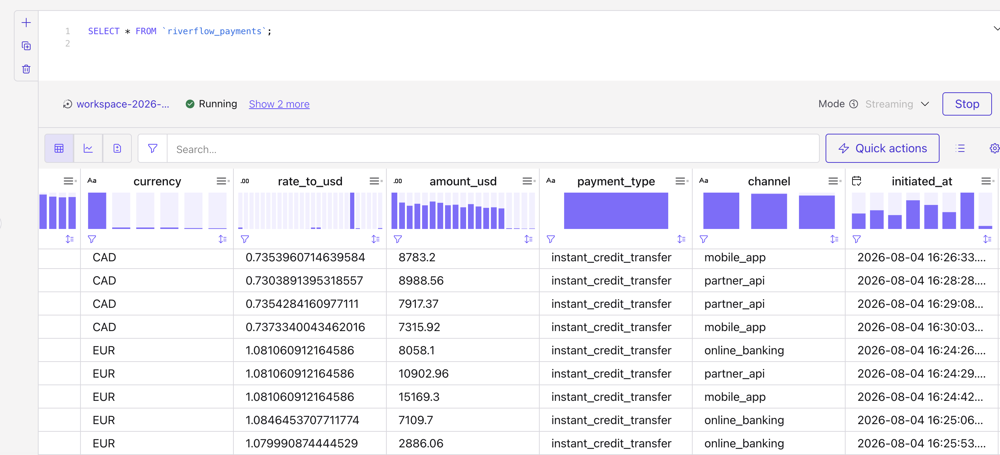
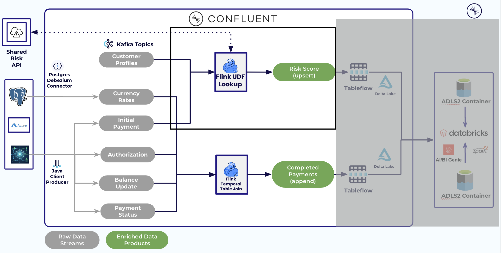
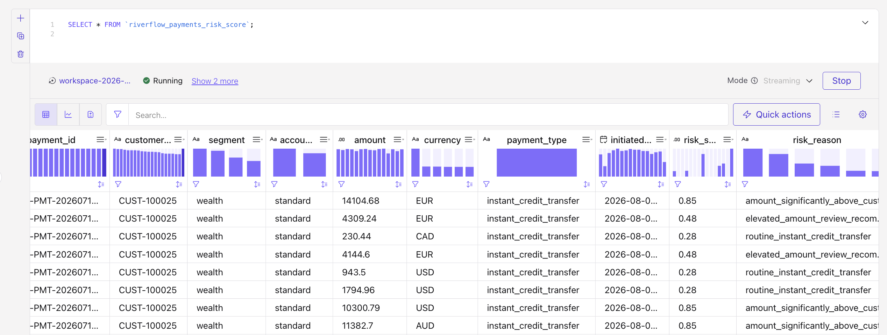
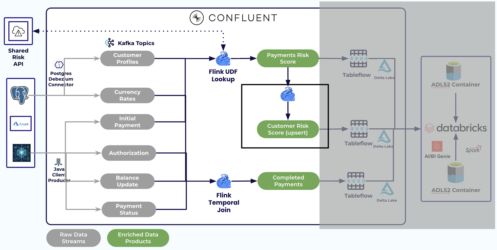

# LAB 3: Stream Processing (Flink)

**Previous:** [LAB 2: Explore Your Environment](../LAB2_explore_environment/LAB2.md)

## Overview

### What you'll accomplish

1. **`riverflow_payments`** — completed payments (4-way inner join + FX temporal join)
2. **`riverflow_payments_risk_score`** — profile temporal join + external risk UDF
3. Aggregate `riverflow_payments_risk_score` into `riverflow_customer_risk_exposure_24h` — trailing-24h risk exposure per customer

`risk_score` is **operational exception probability**, not fraud.



### Prerequisites

Completed **[LAB 2](../LAB2_explore_environment/LAB2.md)**. Flink SQL workspace open with correct catalog/database.

> [!TIP]
> Create several empty cells before you start. Prefer `CREATE OR ALTER MATERIALIZED TABLE` so re-runs are safe. Run each `SET 'client.statement-name' …` in the **same cell** as its `CREATE` (workspace ignores a lone `SET`).

## Steps

### Step 1: Peek at sources

```sql
SELECT * FROM `riverflow.riverpay.customer_profiles` LIMIT 5;
```

> [!NOTE]
> Results may take up to a minute to appear the first time.



```sql
SELECT * FROM `riverflow.riverpay.fx_rates` LIMIT 10;
```

> [!NOTE]
> Results may take up to a minute to appear the first time.



```sql
SELECT * FROM `riverflow.payments.initiation` LIMIT 5;
```

> [!NOTE]
> Results may take up to a minute to appear the first time.



### Step 2: Confirm changelog modes / watermarks

Terraform pre-applies changelog.mode and watermarks on CDC and lifecycle source tables (Azure and AWS). Spot-check one of each:

```sql
SHOW CREATE TABLE `riverflow.riverpay.customer_profiles`;
```



```sql
SHOW CREATE TABLE `riverflow.payments.initiation`;
```

**Expected result:** upsert + compact on profiles/FX; append on lifecycle topics; `$rowtime` watermarks present.

> [!NOTE]
> Profiles and FX rates are **upsert** because they're mutable reference data keyed by `customer_id` / `currency_code` — each new value replaces the old one, giving the temporal join a well-defined "current value per key" to look up. Lifecycle topics are **append** because each stage happens once per `payment_id`, so there's nothing to overwrite.

<details>
<summary>Fallback — only if SHOW CREATE looks incomplete</summary>

Run these one at a time.

Read the topic as a versioned table keyed by `customer_id` — the shape a temporal join needs on its right side, so each payment matches the profile version that was current when it happened. Compaction keeps the newest record per customer on the topic, so that state can always be rebuilt:

```sql
ALTER TABLE `riverflow.riverpay.customer_profiles`
  SET ('changelog.mode' = 'upsert', 'kafka.cleanup-policy' = 'compact');
```

Widen the out-of-order tolerance from Confluent's 180 ms default to 5 seconds, so profile updates that arrive slightly late still count in the join instead of being dropped:

```sql
ALTER TABLE `riverflow.riverpay.customer_profiles`
  MODIFY WATERMARK FOR `$rowtime` AS `$rowtime` - INTERVAL '5' SECOND;
```

Same for FX — a versioned table keyed by `currency_code`, so each payment converts at the rate that applied when it was initiated, not whatever the rate is now:

```sql
ALTER TABLE `riverflow.riverpay.fx_rates`
  SET ('changelog.mode' = 'upsert', 'kafka.cleanup-policy' = 'compact');
```

Same 5-second tolerance for FX rows, so a rate that lands a little late still prices the payments it should:

```sql
ALTER TABLE `riverflow.riverpay.fx_rates`
  MODIFY WATERMARK FOR `$rowtime` AS `$rowtime` - INTERVAL '5' SECOND;
```

The four lifecycle topics are plain event streams, so they stay `append` — they just need the same 5-second tolerance:

```sql
ALTER TABLE `riverflow.payments.initiation`
  SET ('changelog.mode' = 'append');
ALTER TABLE `riverflow.payments.initiation`
  MODIFY WATERMARK FOR `$rowtime` AS `$rowtime` - INTERVAL '5' SECOND;

ALTER TABLE `riverflow.payments.authorization`
  SET ('changelog.mode' = 'append');
ALTER TABLE `riverflow.payments.authorization`
  MODIFY WATERMARK FOR `$rowtime` AS `$rowtime` - INTERVAL '5' SECOND;

ALTER TABLE `riverflow.payments.balance_update`
  SET ('changelog.mode' = 'append');
ALTER TABLE `riverflow.payments.balance_update`
  MODIFY WATERMARK FOR `$rowtime` AS `$rowtime` - INTERVAL '5' SECOND;

ALTER TABLE `riverflow.payments.status`
  SET ('changelog.mode' = 'append');
ALTER TABLE `riverflow.payments.status`
  MODIFY WATERMARK FOR `$rowtime` AS `$rowtime` - INTERVAL '5' SECOND;
```

</details>

### Step 3: Completed payments + FX conversion

Reference: [`flink/fx_conversion.sql`](../../../flink/fx_conversion.sql)

A payment arrives as four separate events, one per topic — `initiation` (started), `authorization` (approved), `balance_update` (money moved), `status` (final outcome). Here you stitch those four back into one row per payment, and convert the amount to USD. The conversion uses a **[temporal join](https://docs.confluent.io/cloud/current/flink/reference/queries/joins.html#temporal-joins)** (`FOR SYSTEM_TIME AS OF`) to look up the FX rate as it stood at the moment the payment was initiated, rather than the rate right now — so a payment is always priced at the rate it actually got. A row appears only once all four stages have arrived, so this table is your list of genuinely completed payments.



#### 🧩 Temporal Join Challenge

Two blanks are left in the `JOIN` line below. Fill in the **FX rates table** to join against (Step 1 showed its rows) and the **watermark column** to join as-of (Step 2 confirmed it on every source table).

```sql
SET 'client.statement-name' = 'riverflow-payments-completed';
CREATE OR ALTER MATERIALIZED TABLE `riverflow_payments` AS
SELECT
  i.`payment_id`,
  i.`customer_id`,
  i.`source_account`,
  i.`destination_account`,
  i.`amount`,
  i.`currency`,
  fx.`rate_to_usd`,
  ROUND(i.`amount` * fx.`rate_to_usd`, 2) AS `amount_usd`,
  i.`payment_type`,
  i.`channel`,
  i.`initiated_at`,
  a.`authorization_code`,
  a.`authorized_at`,
  b.`source_balance_after`,
  b.`destination_balance_after`,
  b.`updated_at` AS `balance_updated_at`,
  s.`status`,
  s.`status_reason`,
  s.`completed_at`
FROM `riverflow.payments.initiation` i
  INNER JOIN `riverflow.payments.authorization` a
    ON i.`payment_id` = a.`payment_id`
  INNER JOIN `riverflow.payments.balance_update` b
    ON i.`payment_id` = b.`payment_id`
  INNER JOIN `riverflow.payments.status` s
    ON i.`payment_id` = s.`payment_id`
  JOIN <FX_RATES_TABLE> FOR SYSTEM_TIME AS OF <WATERMARK_COLUMN> AS fx
    ON fx.`currency_code` = i.`currency`;
```

> [!NOTE]
> **Why a materialized table?** A materialized table is a single object that owns both the schema and the query logic that keeps filling it — Flink creates a backing Kafka topic, registers the schema, and runs the query continuously, so new payments land in the table as they happen. That is also what makes it available to Tableflow and Databricks in LAB 4–5.
>
> Because schema and query live together, you can **evolve** them in place: `CREATE OR ALTER MATERIALIZED TABLE` lets you change the query or add a column and Flink migrates the table for you, instead of dropping the table, recreating it, and juggling offsets and downstream consumers.
>
> Reference: [Materialized Tables in Confluent Cloud for Apache Flink](https://docs.confluent.io/cloud/current/flink/concepts/materialized-tables.html)

Query the new table to see what it produced:

```sql
SELECT * FROM `riverflow_payments`;
```

> [!NOTE]
> Results may take up to a minute to appear the first time.



**Expected result:** Rows appear only for payments that completed all four stages, with `amount_usd` populated.

Validate (SQL workspace or left-pane MT preview / descriptor):

```sql
SELECT * FROM `riverflow_payments` LIMIT 10;
```

### Step 4: Operational risk via external UDF

Reference: [`flink/risk_udf.sql`](../../../flink/risk_udf.sql)

RiverPay's **Risk Scoring API** is the bank's system of record for how likely a payment needs manual intervention — a hold, a review, or a reject. The **[user-defined function](https://docs.confluent.io/cloud/current/flink/concepts/user-defined-functions.html)** (UDF) `lookup_operational_risk(amount, segment, account_tier)` lets Flink ask that service in-stream, so every payment is scored as it happens instead of in an overnight batch. It returns `risk_score|risk_reason`; it only reads, it never updates the customer's profile. Alongside `amount`, it takes two customer attributes from the profile:

- `segment`: customer's relationship type — `retail`, `small_business`, `new_partner`, `wealth`
- `account_tier`: customer's service tier — `standard` or `premium`



#### 🧩 Risk UDF Challenge

Two blanks are left in the `lookup_operational_risk(...)` call below. Fill in the **segment** and **account_tier** arguments — both come from the customer profile joined in as `c`.

`segment` and `account_tier` come from the **customer profile** (temporal join), not the payment event — payment carries `amount` / `currency`; the profile supplies slowly changing customer context used as risk inputs.

```sql
SET 'client.statement-name' = 'riverflow-payments-risk-score';
CREATE OR ALTER MATERIALIZED TABLE `riverflow_payments_risk_score` AS
SELECT
  enriched.`payment_id`,
  enriched.`customer_id`,
  enriched.`segment`,
  enriched.`account_tier`,
  enriched.`amount`,
  enriched.`currency`,
  enriched.`payment_type`,
  enriched.`initiated_at`,
  CAST(SPLIT_INDEX(enriched.`risk_payload`, '|', 0) AS DOUBLE) AS `risk_score`,
  SPLIT_INDEX(enriched.`risk_payload`, '|', 1) AS `risk_reason`,
  CURRENT_TIMESTAMP AS `enrichment_timestamp`
FROM (
  SELECT
    p.`payment_id`,
    p.`customer_id`,
    c.`segment`,
    c.`account_tier`,
    p.`amount`,
    p.`currency`,
    p.`payment_type`,
    p.`initiated_at`,
    lookup_operational_risk(p.`amount`, <SEGMENT>, <ACCOUNT_TIER>) AS `risk_payload`
  FROM `riverflow.payments.initiation` p
    JOIN `riverflow.riverpay.customer_profiles` FOR SYSTEM_TIME AS OF p.`$rowtime` AS c
      ON c.`customer_id` = p.`customer_id`
) AS enriched;
```

Query the new table to see what it produced:

```sql
SELECT * FROM `riverflow_payments_risk_score`;
```

> [!NOTE]
> Results may take up to a minute to appear the first time.



**Expected result:** Upsert rows with readable `risk_reason` values such as `amount_significantly_above_customer_baseline`, `new_partner_bank_customer`, `routine_instant_credit_transfer`. Soft-fail reasons (`risk_api_*`) mean the shared API call failed — see LAB 2 / troubleshooting.

### Step 5: Customer risk exposure (trailing 24h)

Reference: [`flink/customer_risk_exposure_24h.sql`](../../../flink/customer_risk_exposure_24h.sql)

Step 4 scores each payment individually. But Dana's ops team also needs the customer-level view: *which customers are accumulating the most exception exposure right now?* Here you roll those per-payment scores up into one row per customer, covering their last 24 hours — and it refreshes the moment that customer's next payment is scored.

Two things make that work. An `OVER` window recomputes on every event, rather than waiting for a window to close the way `HOP`/`TUMBLE` would. And declaring `PRIMARY KEY (customer_id)` keeps it to one row per customer, updated in place, instead of adding a new row per payment.



```sql
SET 'client.statement-name' = 'riverflow-customer-risk-exposure-24h';
CREATE OR ALTER MATERIALIZED TABLE `riverflow_customer_risk_exposure_24h` (
  PRIMARY KEY (`customer_id`) NOT ENFORCED
)
WITH (
  'changelog.mode' = 'upsert',
  'kafka.cleanup-policy' = 'compact'
) AS
WITH risk_last_24h AS (
  SELECT
    `customer_id`,
    `segment`,
    `account_tier`,
    COUNT(*) OVER w AS `payment_count`,
    AVG(`risk_score`) OVER w AS `avg_risk_score`,
    MAX(`risk_score`) OVER w AS `max_risk_score`,
    `$rowtime` AS `updated_at`
  FROM `riverflow_payments_risk_score`
  WINDOW w AS (
    PARTITION BY `customer_id`
    ORDER BY `$rowtime`
    RANGE BETWEEN INTERVAL '24' HOUR PRECEDING AND CURRENT ROW
  )
)
SELECT * FROM risk_last_24h;
```

Confirm the table is keyed and upserting, the same way you confirmed `customer_profiles`/`fx_rates` back in Step 2:

```sql
SHOW CREATE TABLE `riverflow_customer_risk_exposure_24h`;
```

> [!NOTE]
> Expect `'changelog.mode' = 'upsert'`, `'kafka.cleanup-policy' = 'compact'`, and a `CONSTRAINT ... PRIMARY KEY (\`customer_id\`) NOT ENFORCED` line in the output.

Query the new table to see what it produced:

```sql
SELECT * FROM `riverflow_customer_risk_exposure_24h`;
```

> [!NOTE]
> Results may take up to a minute to appear the first time.

> [!NOTE]
> **Known limitation:** a customer's row only refreshes when they have a *new* payment. If a customer goes quiet, their numbers stay frozen at their last-computed trailing-24h value instead of decaying — there's no background clock forcing recomputation. For this workshop's continuous traffic, that edge case rarely surfaces.

**Expected result:** One row per customer. Re-run the `SELECT` after a minute or two and watch `payment_count`/`avg_risk_score` change for active customers as new payments arrive — that's the upsert in action.

#### Checkpoint

- [ ] `riverflow_payments` has completed payments with `rate_to_usd` / `amount_usd`
- [ ] `riverflow_payments_risk_score` has `risk_score` + `risk_reason` from the UDF path
- [ ] `riverflow_customer_risk_exposure_24h` is confirmed upsert via `SHOW CREATE TABLE`, and updates in place as new payments arrive

## Conclusion

You produced the three Flink data products Elevate cares about: FX-aware completed payments, externally scored operational risk, and trailing-24h risk exposure per customer.

## What's next

**[LAB 4: Tableflow](../LAB4_tableflow/LAB4.md)**
