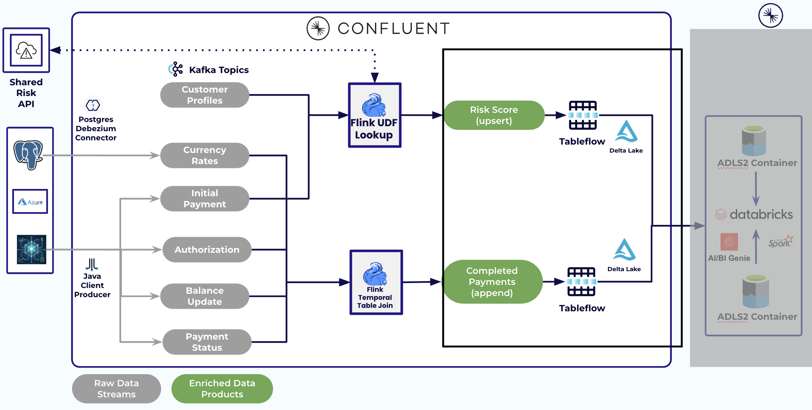
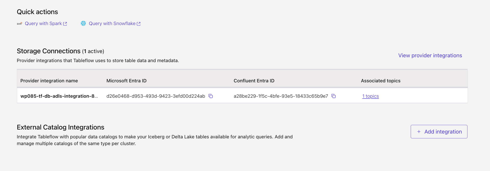
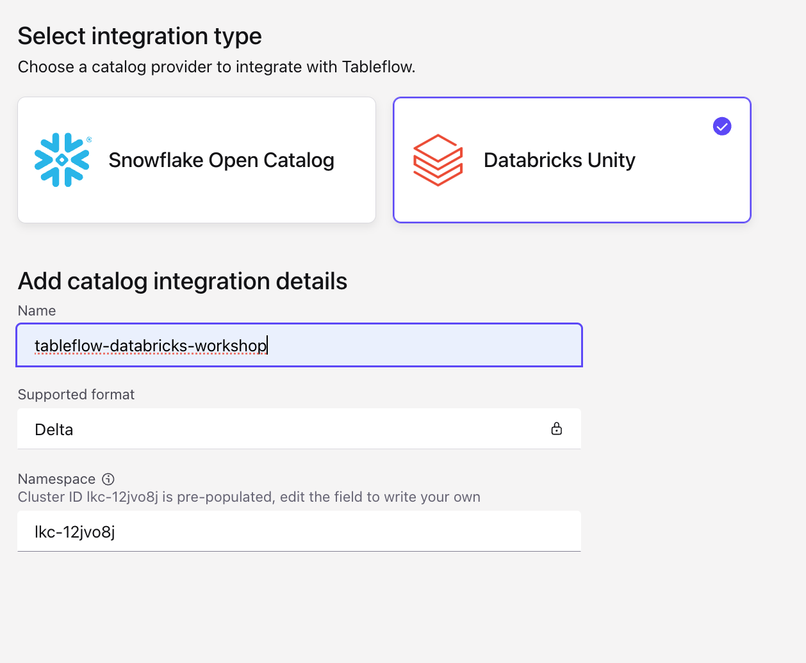
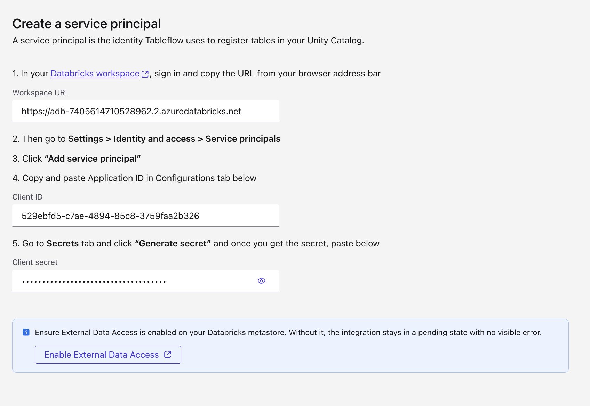
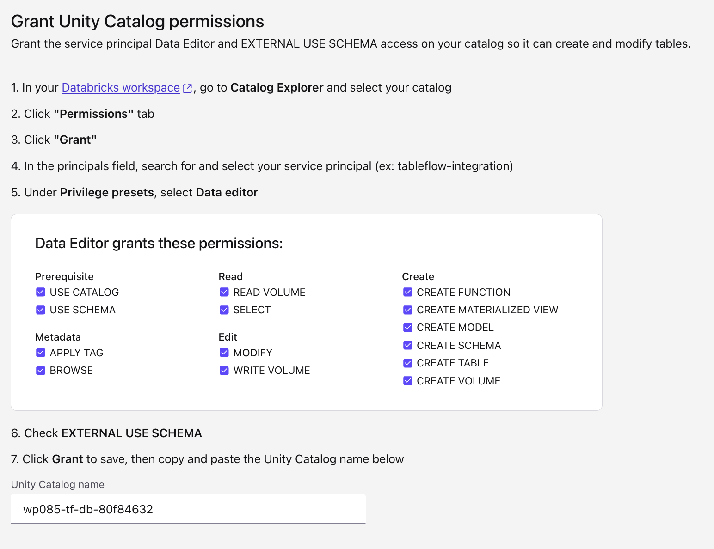
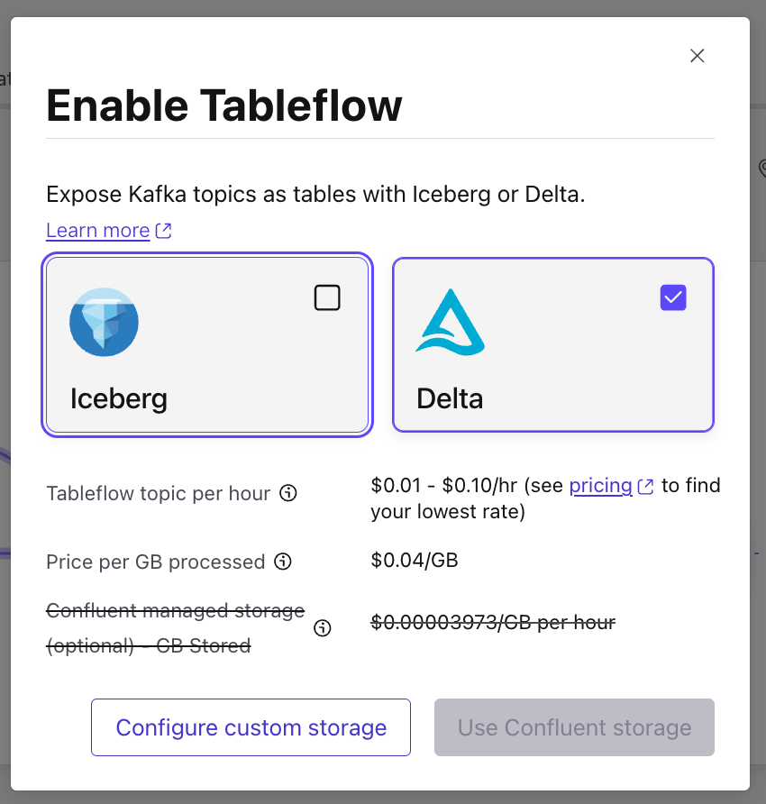
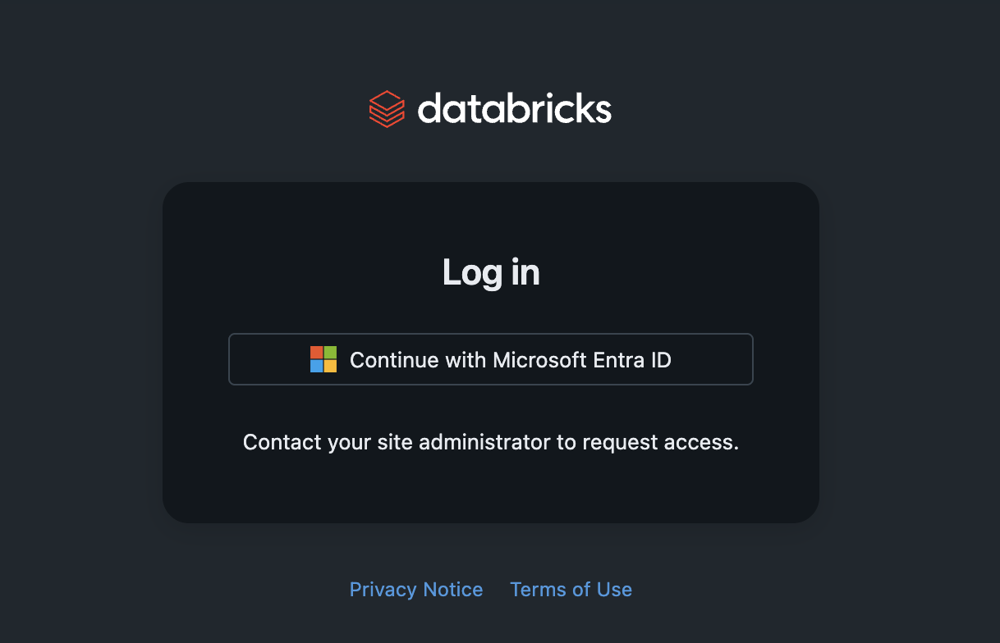
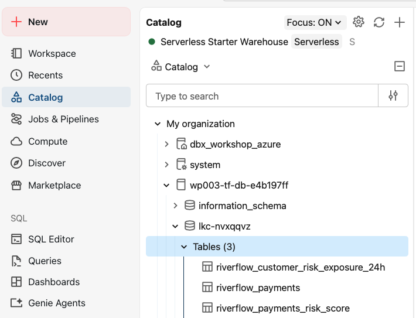
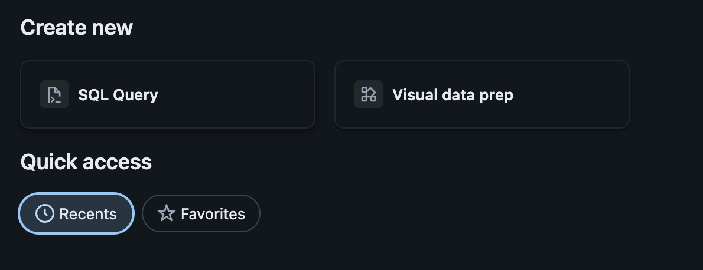
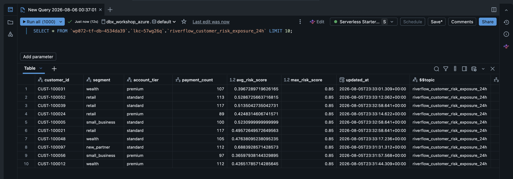

# LAB 4: Tableflow

**Previous:** [LAB 3: Stream Processing](../LAB3_stream_processing/LAB3.md)

## Overview

Publish the Flink data products to Databricks Unity Catalog with Tableflow (Delta).



### What you'll accomplish

1. Create the Unity Catalog integration for Tableflow
2. Enable Tableflow on `riverflow_payments` (append), `riverflow_payments_risk_score` (append), and `riverflow_customer_risk_exposure_24h` (upsert)
3. Verify Delta tables in Databricks

### Prerequisites

Completed **[LAB 3](../LAB3_stream_processing/LAB3.md)** with all three materialized tables populated.

## Steps

### Step 1: Catalog integration

Create the Tableflow → Unity Catalog integration yourself:

1. Open **[Tableflow](https://confluent.cloud/go/tableflow)** → **External Catalog Integrations** → **+ Add integration**

   

2. Select integration type **Databricks Unity**, then fill in the integration details:

   | Field | Value |
   |-------|-------|
   | Name | A name for this integration, e.g. `tableflow-databricks-workshop` |
   | Supported format | `Delta` (fixed) |
   | Namespace | Pre-populated with your Kafka cluster ID — leave as is |

   

3. Fill in the service principal fields using the values from the email you received:

> [!NOTE]
> Use the **client ID** and **client secret** here — not the Databricks email and password you use to log into the workspace.

   | Field | Value |
   |-------|-------|
   | Workspace URL | Your Databricks host |
   | Client ID | Databricks service principal client ID |
   | Client secret | Databricks service principal client secret |

   

4. Copy your **Unity Catalog name** (from the email you received) and paste it into the Confluent Cloud form.

> [!TIP]
> The service principal's Unity Catalog permissions — Data editor + EXTERNAL USE SCHEMA — are pre-granted for instructor-led, so you don't need to set those up yourself.

   

5. Follow the wizard to launch the integration

> [!NOTE]
> The integration shows **Pending** until Tableflow is enabled on at least one topic — that happens in Step 2.

### Step 2: Enable Tableflow on real-time data products only

Enable Tableflow for:

| Topic / table | Mode |
|---------------|------|
| `riverflow_payments` | append |
| `riverflow_payments_risk_score` | append |
| `riverflow_customer_risk_exposure_24h` | upsert |

> [!WARNING]
> Do **not** Tableflow-enable raw lifecycle CDC topics in this workshop.

#### 🧩 Enable Tableflow Challenge

In the **[Topic UI](https://confluent.cloud/go/topics)**, find where to enable Tableflow on one of the three topics above, choose **Delta** as the table format. Repeat for the other two topics.



<details>
<summary>Hint</summary>

If you choose custom storage, you'll need:

- **Azure storage account name**
- **Container name**

Both are in the email you received.

</details>

> [!TIP]
> Don't wait for Tableflow to finish enabling — move on to the next topic while it spins up. Syncing starts within a few minutes, and the tables then appear in your Databricks catalog.

### Step 3: Verify in Databricks

1. Open the **Databricks workspace URL** from the email, choose **Continue with Microsoft Entra ID**, and sign in with the Databricks email and password from that same email.

   

> [!NOTE]
> If you see a transient **403**, refresh the page.

2. Confirm you land on the workspace home, then open **SQL Editor** from the left nav.

   

3. Under **Create new**, click **SQL Query**.

   

4. Select your **catalog** and **schema** from the dropdowns above the editor — both are in the email too.

5. Run the queries below.

```sql
SHOW TABLES;

SELECT * FROM `riverflow_payments` LIMIT 10;

SELECT * FROM `riverflow_payments_risk_score` LIMIT 10;

SELECT * FROM `riverflow_customer_risk_exposure_24h` LIMIT 10;
```

> [!NOTE]
> The first run may ask you to select a warehouse, and to start it if it's stopped. Pick the warehouse in your workspace and start it — it comes up in a few seconds, then the query runs.



> [!TIP]
> Same rows you built in Flink, now queryable in Databricks — no pipeline, no copy job. Tableflow published the Kafka topic straight into Unity Catalog as a Delta table.

#### Checkpoint

- [ ] Catalog integration created and healthy
- [ ] All three real-time data products enabled for Tableflow
- [ ] Rows visible in Databricks for all three tables

## Conclusion

Governed Delta tables are ready for RiverPulse / Genie.

## What's next

**[LAB 5: RiverPulse Analytics](../LAB5_riverpulse_analytics/LAB5.md)**
