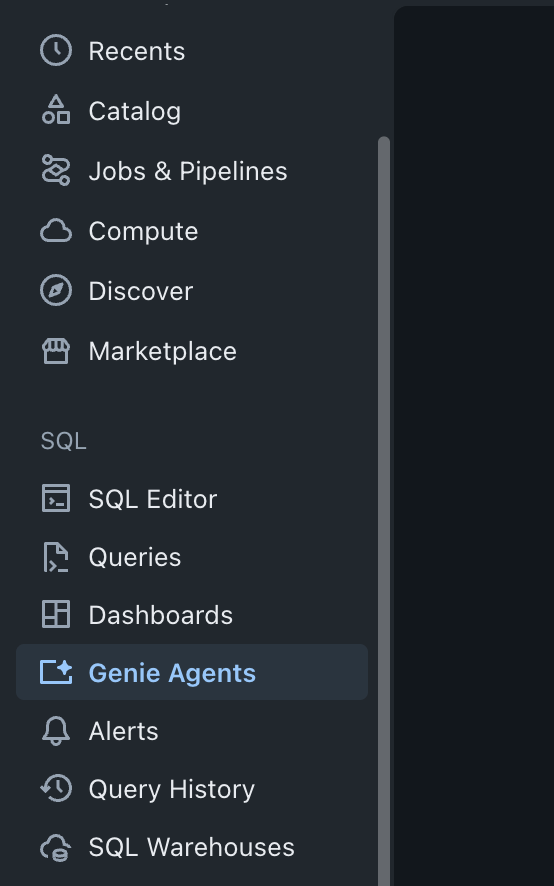
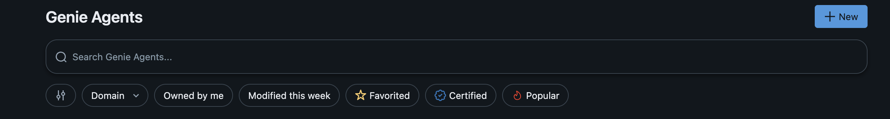
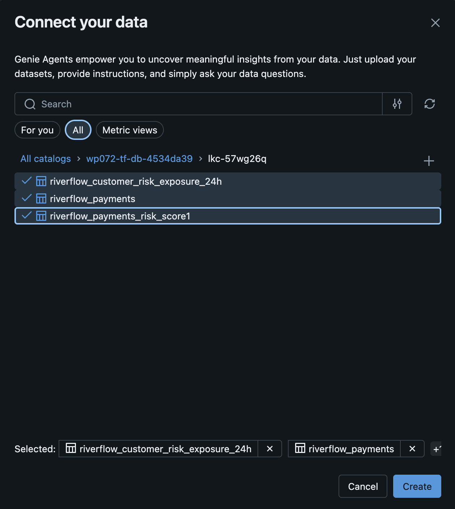
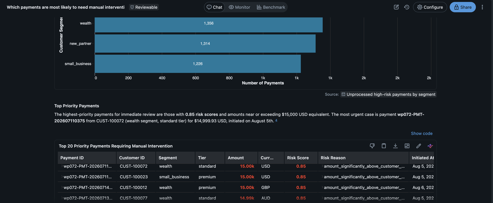
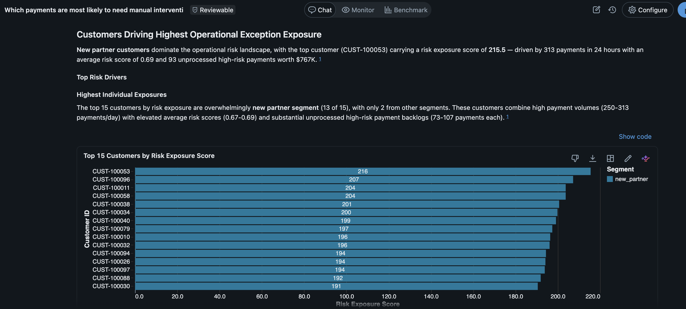
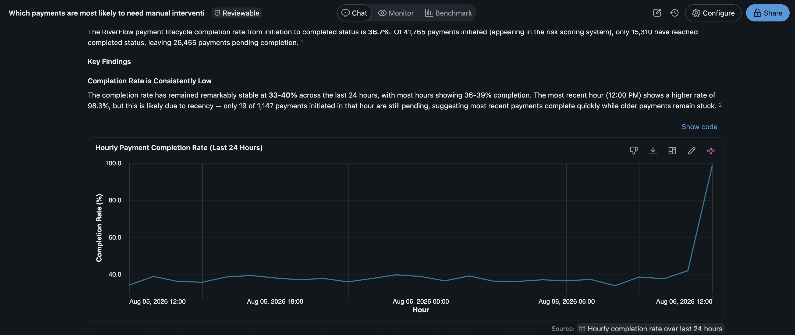
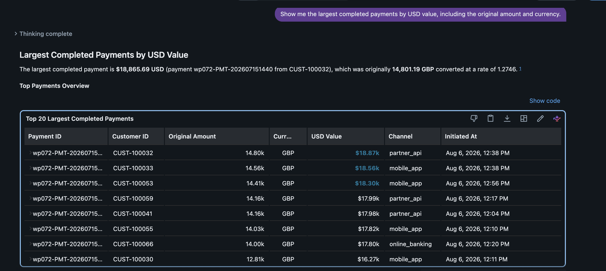
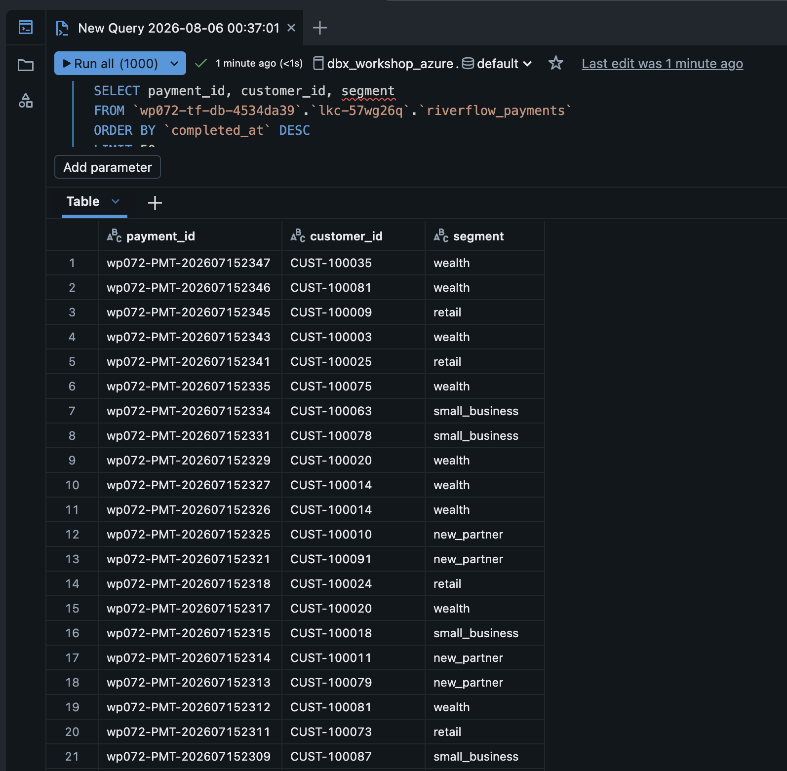
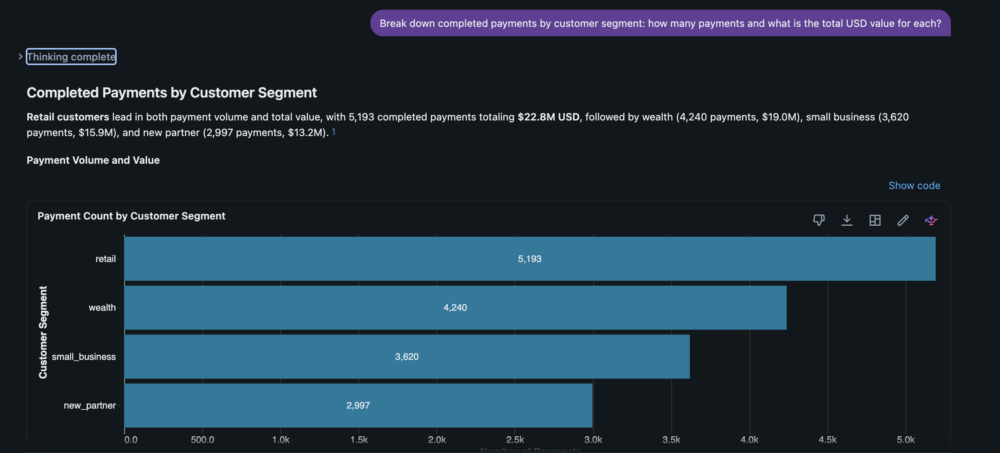

# LAB 5: RiverPulse Analytics (Genie)

**Previous:** [LAB 4: Tableflow](../LAB4_tableflow/LAB4.md)

## Overview

Use Databricks Genie to answer RiverPay’s three operational questions against Tableflow tables.


### Three business questions

1. Which payments are most likely to need manual intervention right now?
2. Which customers drive the highest operational exception exposure in the last 24 hours?
3. What is the RiverFlow lifecycle completion rate from initiation to completed status?

(Phase 1 completion rate is a proxy: completed = 4-way join + FX enrichment / initiated_enriched. Stall drill-down is Phase 2.)

### Prerequisites

Completed **[LAB 4](../LAB4_tableflow/LAB4.md)**. Have catalog, schema, and SQL warehouse ID from your credentials email.

## Steps

### Step 1: Create your Genie agent

1. In Databricks, open **Genie Agents** from the left nav, under **SQL**

   

2. Click **+ New**

   

3. In **Connect your data**, click **All**, browse to your catalog → schema (both in your credentials email) and select all three RiverFlow tables, then click **Create**

   

### Step 2: Ask the three questions

Paste these into Genie one at a time:

> [!NOTE]
> Each prompt takes around 1–2 minutes to complete — Genie has to pick the tables, write the SQL, and run it on your warehouse.

**Q1 — Highest exception-probability payments**

```text
Which payments are most likely to need manual intervention right now?
```



**Q2 — Highest-risk customers (last 24 hours)**

```text
Which customers drive the highest operational exception exposure in the last 24 hours?
```



**Q3 — Lifecycle completion rate**

```text
What is the RiverFlow lifecycle completion rate from initiation to completed status?
```



Optional, if you want to see the FX enrichment at work:

```text
Show me the largest completed payments by USD value, including the original amount and currency.
```




### Step 3: Answer a question the data product can't answer yet (Schema Evolution)

Dana comes back with a follow-up: *are these exceptions concentrated in one part of our customer base?* Ask Genie to break completed payments down by customer segment and it can't — `riverflow_payments` has no `segment` column. Nobody thought to include it when the product was built.

In a batch world this is a change request: a ticket, a backfill, a new table, and a wait. Here it's an edit to the query that's already running.

#### 🧩 Schema Evolution Challenge

Two blanks are left in the statement below. Fill in the **column** to add to the product, and the **table to join** for it — the same reference data you looked up in LAB 3.

Go back to your **[Flink SQL workspace](https://confluent.cloud/go/flink)** and run:

```sql
SET 'client.statement-name' = 'riverflow-payments-completed-v2';
CREATE OR ALTER MATERIALIZED TABLE `riverflow_payments` AS
SELECT
  i.`payment_id`,
  i.`customer_id`,
  i.`source_account`,
  i.`destination_account`,
  i.`amount`,
  i.`currency`,
  fx.`rate_to_usd`,
  ROUND(i.`amount` * fx.`rate_to_usd`, 2) AS `amount_usd`,
  i.`payment_type`,
  i.`channel`,
  i.`initiated_at`,
  a.`authorization_code`,
  a.`authorized_at`,
  b.`source_balance_after`,
  b.`destination_balance_after`,
  b.`updated_at` AS `balance_updated_at`,
  s.`status`,
  s.`status_reason`,
  s.`completed_at`,
  c.<SEGMENT_COLUMN>
FROM `riverflow.payments.initiation` i
  INNER JOIN `riverflow.payments.authorization` a
    ON i.`payment_id` = a.`payment_id`
  INNER JOIN `riverflow.payments.balance_update` b
    ON i.`payment_id` = b.`payment_id`
  INNER JOIN `riverflow.payments.status` s
    ON i.`payment_id` = s.`payment_id`
  JOIN `riverflow.riverpay.fx_rates` FOR SYSTEM_TIME AS OF i.`$rowtime` AS fx
    ON fx.`currency_code` = i.`currency`
  LEFT JOIN <JOIN_TABLE> FOR SYSTEM_TIME AS OF i.`$rowtime` AS c
    ON c.`customer_id` = i.`customer_id`;
```

<details>
<summary>Hint</summary>

The table is **customer profiles** — the same one LAB 3 Step 4 temporal-joined to score each payment. Run `SHOW TABLES IN riverflow.riverpay;` if you need its exact name.

The column is the customer's relationship type: `retail`, `small_business`, `new_partner`, or `wealth`.

</details>

Nothing downstream had to be rebuilt, and nothing had to be taken down to do it. You didn't stop the statement, drop and recreate the table, or think about consumer offsets — the **Materialized Table** owns both the schema and the query, so Flink migrated it in place and kept going. Tableflow then carried the new column into Delta on its own, and Unity Catalog picked it up. End to end, the evolution was seamless

> [!NOTE]
> The `segment` column appears in Databricks straight away, but every value is `NULL` at first — payments that completed before the change don't carry one. Give it 2–3 minutes for new payments to flow through the updated statement; those are the rows with a segment.

Check the new column in the Databricks **SQL Editor**:

```sql
SELECT `payment_id`, `customer_id`, `segment`
FROM `<catalog>`.`<schema>`.`riverflow_payments`
ORDER BY `completed_at` DESC
LIMIT 50;
```



Now go back to Genie and ask the question that failed a minute ago:

```text
Break down completed payments by customer segment: how many payments and what is the total USD value for each?
```



> [!TIP]
> **Why this matters commercially.** Two properties made that a five-minute change instead of a project. The column was **added**, not moved or renamed — existing consumers keep reading the table exactly as before, so nothing had to be coordinated or re-tested. And the profile lookup is a `LEFT JOIN`, so a payment with no matching profile still appears; the table's meaning — every completed payment — is unchanged. Evolving a live data product is a normal Tuesday, not a migration.

> [!NOTE]
> Payments that completed **before** you ran this show `NULL` for `segment` — the column is added going forward, not backfilled onto history. Sorting by `completed_at DESC` shows the populated rows first. If your team needs the full history filled in, that's a separate backfill job.


#### Checkpoint

- [ ] Genie (or SQL) answers all three questions
- [ ] At least one high `risk_score` row has a readable `risk_reason`
- [ ] `riverflow_payments` carries `segment` in Databricks, and Genie can break payments down by segment

## Conclusion

RiverPulse turns real-time RiverFlow products into ops answers — without an end-of-day batch wait.

## What's next

**[LAB 6: Wrap Up](../LAB6_wrap_up/LAB6.md)**
