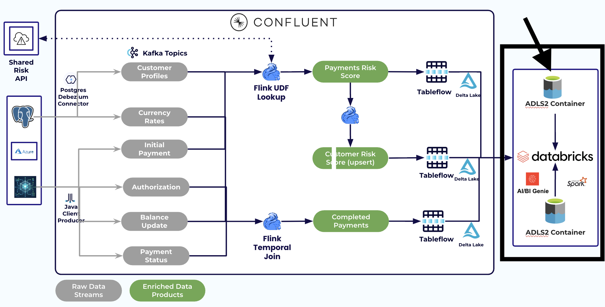

# LAB 5: RiverPulse Analytics (Genie)

**Previous:** [LAB 4: Tableflow](../LAB4_tableflow/LAB4.md)

## Overview

Use Databricks Genie to answer RiverPay’s three operational questions against Tableflow tables.



### Three business questions

1. Which payments are most likely to need manual intervention right now?
2. Which customers drive the highest operational exception exposure in the last 24 hours?
3. What is the RiverFlow lifecycle completion rate from initiation to completed status?

(Phase 1 completion rate is a proxy: completed = 4-way join + FX enrichment / initiated_enriched. Stall drill-down is Phase 2.)

### Prerequisites

Completed **[LAB 4](../LAB4_tableflow/LAB4.md)**. Have catalog, schema, and SQL warehouse ID from your credentials email.

## Steps

### Step 1: Open Genie

1. In Databricks, open **Genie**
2. Attach your workshop catalog/schema (and warehouse)

### Step 2: Ask the three questions

Use prompts from [`sql/genie_prompts.md`](../../../sql/genie_prompts.md).

> [!NOTE]
> **Expected shape (not brittle golden rows)**
>
> - Q1: payments ordered by `risk_score` with `risk_reason`
> - Q2: customers ranked by avg/max `risk_score` over recent window
>
> A customer's row only updates when they have a new payment — a quiet customer's numbers won't decay to zero, they'll just stay at their last-computed value.
> - Q3: `initiated_enriched`, `completed`, `completion_rate`
>
> Exact IDs/amounts change with live ShadowTraffic data. `risk_score` is **not** fraud.

### Step 3: Optional SQL views

If operators created RiverPulse views:

```sql
SELECT * FROM <catalog>.<schema>.riverpulse_high_risk_payments LIMIT 20;
SELECT * FROM <catalog>.<schema>.riverpulse_customer_risk_24h LIMIT 20;
SELECT * FROM <catalog>.<schema>.riverpulse_lifecycle_completion;
```

Otherwise query `riverflow_payments_risk_score` / `riverflow_payments` directly.

#### Checkpoint

- [ ] Genie (or SQL) answers all three questions
- [ ] At least one high `risk_score` row has a readable `risk_reason`

## Conclusion

RiverPulse turns real-time RiverFlow products into ops answers — without an end-of-day batch wait.

## What's next

**[LAB 6: Wrap Up](../LAB6_wrap_up/LAB6.md)**
